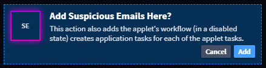

Applets and Tasks
=================

You can create an applet that contains common tasks or associated tasks.
When you add the applet to an application, Swimlane notifies you that
the applet workflow is being added to the application and new
application tasks will be created for each of the applet tasks. the
workflow is also being added as well as any applet tasks.

|image1|

Within the applet builder, you have the option to create a new task or
edit an existing task. Both of these require that you save the applet
before continuing with the task.

In the task editor, on the **General** tab you can change the name, add
a description, see the task parent and task type, and choose to enable
or disable the task.

On the **Configuration** tab, in the **Debugger** subtab, you can click
**Run Task** to check your script. Unlike application tasks, applet
tasks can not be tested against a record.

