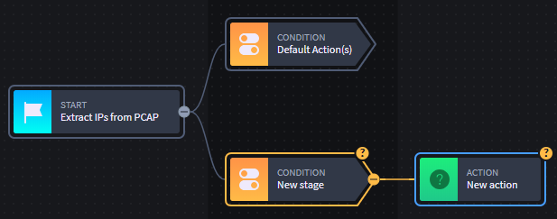
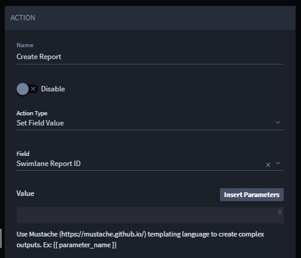
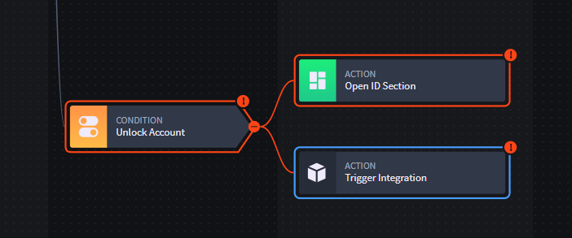

Applets and Workflow
====================

You can create an applet that contains workflow. When you add an applet
to an application, Swimlane notifies you that the applet workflow is
being added to the application and new application tasks will be created
for each of the applet tasks. The workflow is also added, as well as any
applet tasks.

|image1|

As you build out workflow within an applet, the branches don't have to
be fully configured. Conditions and actions in applet workflow are
highlighted with a question mark and a yellow outline.

|image2|

Saved applets can then be added to applications. Save the application
with the new applet, and then access the application's workflow to
enable the stages and actions.

When you access the workflow editor, you can see that the workflow is
there, but by default it is added in a disabled state. You will need to
manually activate the workflow stages and actions.

|image3|

Workflow behavior has been updated to alert you to enable workflow
stages and actions. When you first access the Workflow editor after
adding an applet with workflow, the editor highlights the section of new
workflow in a glowing, pulsing yellow. After that, you'll see the
workflow stages and actions are greyed out. Click the workflow stages
and actions to enable them and (as needed) to continue to configure
them.

An exclamation mark and a red outline on a workflow branch indicates
that the workflow is not completely configured yet. Click the branches
of the workflow and configure the stages and actions as necessary.

|image4|

.. |image1| image:: ../../../Resources/Images/workflow-and-tasks-added-dialog.png

