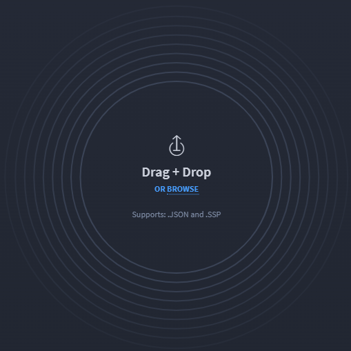
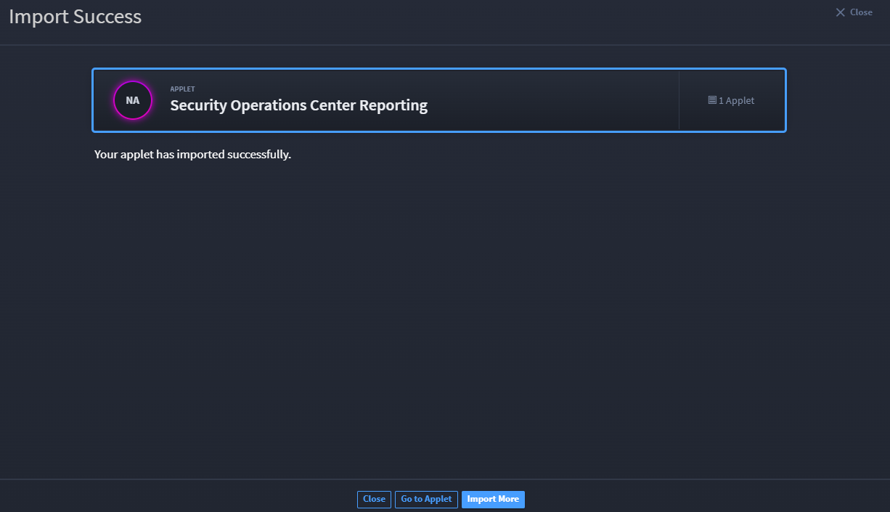

Import Applets
==============

You can import applets to Swimlane. Any imported file needs to be a
.json file type and needs to have a unique name and Swimlane acronym.

To import an applet:

#. From the Applications and Applets main page, click the plus menu icon
   and then select **Import applications and applets.**

   |image1|

   You are prompted to drag and drop the file to the Swimlane window, or
   click **Browse** to navigate locally for the file.

#. Swimlane imports the .json file and reports back to you on the status
   of the import. On Import Success, review the import messaging, and
   then click **Go to Applet** or **Import More**.

   |image2|

   If the import is not successful, you will receive messaging to
   instruct you why it is failing, and from those messages you can
   decide what your next steps should be.

