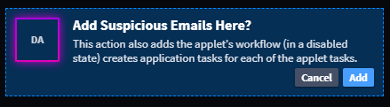

Add Applets
===========

You can add applets to your application from Application Builder. An
applet is a preconfigured set of fields, layout specifications, and
tasks for Swimlane. Applets are appended to an existing application form
layout and are designed to allow users to easily update and expand their
existing applications.

To add applets to your application, select an applet, and then drag and
drop it to the Form Layout. Drop the field in the layout area.

When adding an applet that contains tasks or a workflow, a dialogue
appears informing you that these tasks and the workflow will be
duplicated to the application. These duplicated tasks will appear on the
Integrations page with the application acronym in brackets before the
task name.

|image1|

You can modify applets in the form layout after dropping them in.

For more about applets, see `Applet
Builder <../applet-builder/applet-builder.htm>`__.

