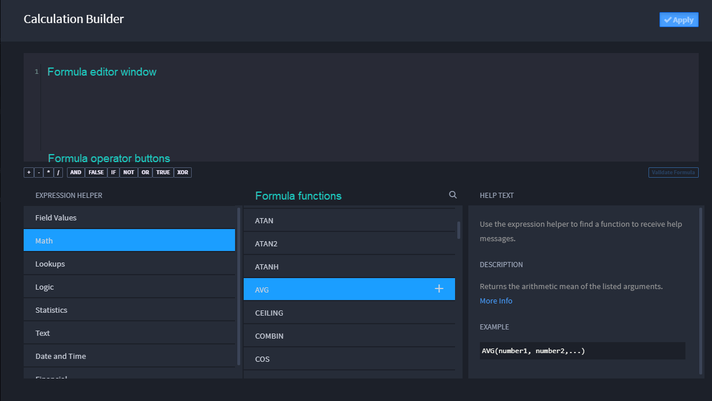
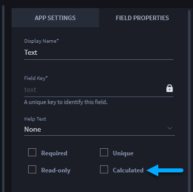
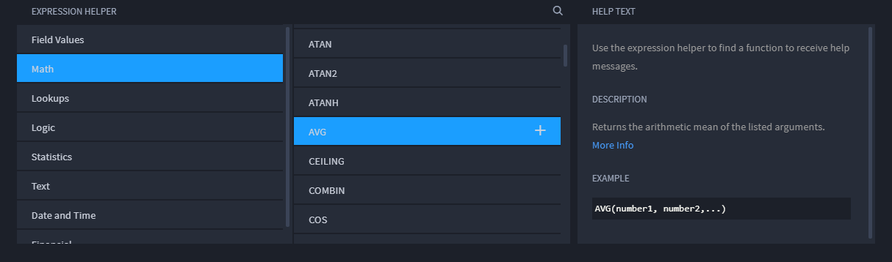

Calculation Builder
===================

Fields specified as calculations are read-only. The value of a
calculated field is the result of a calculation defined with a custom
formula. Calculated fields can be either text or numeric, but cannot be
lists.

Calculated Fields are processed on all Record GET (including the default
Record for App endpoint), Record POST and Record PUT in addition to the
explicit Calculate Field endpoint ("app//record//calc/"). Swimlane uses
Synfusion Calc to process calculations, and also uses the same syntax.
The success and/or failure of calculations is recorded in logged
activity in Swimlane.

**Note:** Be aware of the output type of your calculation when creating
the calculation result field.

The Calculation Builder consists of the following:

-  Formula editor window
-  Formula operator buttons
-  Validate formula button
-  Expression Helper
-  Formula functions
-  Help Text

|image1|

To create a calculated field:

#. | Select the Calculated option on the Field Properties panel.
   | |image2|

Calculation Builder opens.

2. On Calculation Builder, enter a formula, or use Swimlane's expression
   helper to find a formula. The Expression Helper contains all of the
   field values from your Swimlane application, and the following
   formulas:

-  Math
-  Lookup expressions (which specify a value obtained from records or
   data tables)
-  Logic (also known as Boolean)
-  Statistics
-  Text
-  Date and Time
-  Financial

3. | Once you select a formula type, the available formula options are
     provided for you.
   | |image3|

4. Click the **+** symbol by the formula option to load it into the
   formula window.

