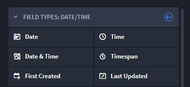

Date / Time
===========

Use a Date / Time field when you need to store date and time data in a
record.

|image1|

When creating a Date / Time field, you can choose from these types:

+-------------------+-------------------------------------------------+
| Field Type        | Description                                     |
+===================+=================================================+
| **Date**          | Use to store a specific date in a record.       |
+-------------------+-------------------------------------------------+
| **Time**          | Use to store a specific time in a record.       |
+-------------------+-------------------------------------------------+
| **Date & Time**   | Use to store a specific date and time together  |
|                   | within a record.                                |
+-------------------+-------------------------------------------------+
| **Timespan**      | Use to record the difference between two dates  |
|                   | in your record. Enter the timespan manually, or |
|                   | from within this field type, select the         |
|                   | **Automatic Time Difference** field and then    |
|                   | select the date and time fields that will track |
|                   | the timespan.                                   |
+-------------------+-------------------------------------------------+
| **First Created** | Select to have Swimlane collect the date and    |
|                   | time the record was initiated.                  |
+-------------------+-------------------------------------------------+
| **Last Updated**  | Select to have Swimlane collect the most recent |
|                   | date and time the record was edited.            |
+-------------------+-------------------------------------------------+

To create date/time fields:

From Application Builder's Field Types, select a Date / Time field and
then drag and drop it to the Form Layout. Drop the field in the layout
area, or within a Tab or Section layout object.

Access the field's Field Properties and complete the following fields as
needed:

+------------------+------------------------+------------------------+
| Field            | Step                   | Example                |
+==================+========================+========================+
| **Display Name** | Enter the name of the  | January 3, 2018        |
|                  | field.                 |                        |
+------------------+------------------------+------------------------+
| **Help Text**    | Enter contextual help  | *Enter the date that   |
|                  | text. You will first   | the issue needs to be  |
|                  | need to specify        | resolved by.*          |
|                  | whether the help text  |                        |
|                  | will appear above or   |                        |
|                  | below the field in the |                        |
|                  | record form, and then  |                        |
|                  | you can enter the      |                        |
|                  | text.                  |                        |
+------------------+------------------------+------------------------+
| **Required**     | Click to indicate      | *checkmark*            |
|                  | whether entering data  |                        |
|                  | in the field is        |                        |
|                  | required to process    |                        |
|                  | the record.            |                        |
+------------------+------------------------+------------------------+
| **Read-only**    | Click to indicate that | *checkmark*            |
|                  | the field is read-only |                        |
|                  | for the record. The    |                        |
|                  | field will not be      |                        |
|                  | editable.              |                        |
+------------------+------------------------+------------------------+
| **Calculated**   | Click to indicate that | *T                     |
|                  | the field contains a   | OTALMINUTES([Date/Time |
|                  | mathematical           | Opened], [Date/Time    |
|                  | calculation.           | Closed])*              |
|                  | Calculated fields are  |                        |
|                  | read-only and the      |                        |
|                  | value is the result of |                        |
|                  | a calculation defined  |                        |
|                  | with a custom formula. |                        |
|                  | Once you select this   |                        |
|                  | checkmark, the         |                        |
|                  | Calculation Expression |                        |
|                  | Help opens, and you    |                        |
|                  | can define your        |                        |
|                  | formula or function.   |                        |
|                  | See `Calculation       |                        |
|                  | Builder <../calcu      |                        |
|                  | lation-builder.htm>`__ |                        |
|                  | for more information.  |                        |
+------------------+------------------------+------------------------+

Next, consider the following advanced options in the Field Properties
tab:

+-------------------+-----------------------------+------------------+
| Field             | Step                        | Example          |
+===================+=============================+==================+
| **Min Mode**      | Use to specify the smallest | Day, Month, Year |
|                   | date unit that can be       |                  |
|                   | stored in the field.        |                  |
+-------------------+-----------------------------+------------------+
| **Default Value** | Select the value that will  | none             |
|                   | be the default date. You    |                  |
|                   | can select none, current,   |                  |
|                   | specific, future, or past.  |                  |
+-------------------+-----------------------------+------------------+

Add specific field-level permissions by role, if needed, and then click
**Apply.**

