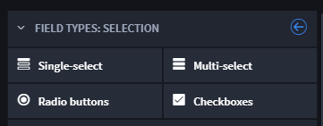
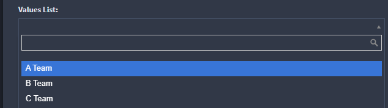
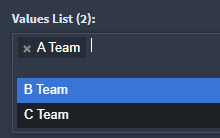
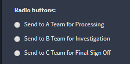
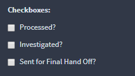
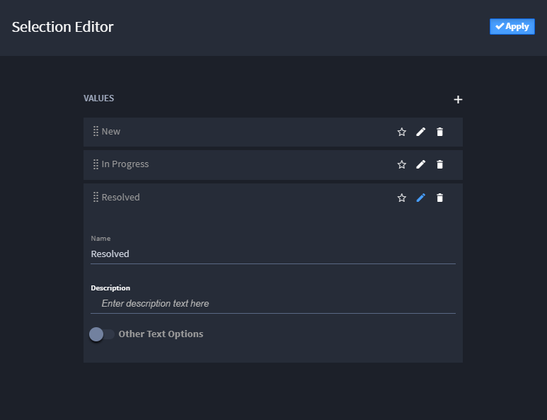

Selection
=========

Use this field when you need to select values from a list of pre-defined
options. A selection field can be single-select or multi-select, and
require a minimum and maximum number of selected items.

|image1|

When creating a selection field, you can choose from these types:

+-------------------+---------------------------+--------------------+
| Field Type        | Description               | Example in Records |
+===================+===========================+====================+
| **Single-select** | Use to display a list of  | |image10|          |
|                   | values, one of which can  |                    |
|                   | be selected for the       |                    |
|                   | record.                   |                    |
+-------------------+---------------------------+--------------------+
| **Multi-select**  | Use to display a list of  | |image11|          |
|                   | values, one or more of    |                    |
|                   | which can be selected for |                    |
|                   | the record.               |                    |
+-------------------+---------------------------+--------------------+
| **Radio buttons** | Use to display radio      | |image12|          |
|                   | button choices of values. |                    |
+-------------------+---------------------------+--------------------+
| **Checkboxes**    | Use to display checkboxes | |image13|          |
|                   | of value options.         |                    |
+-------------------+---------------------------+--------------------+

To create selection fields:

From Application Builder's Field Types, select a selection field and
then drag and drop it to the Form Layout. Drop the field in the layout
area, or within a Tab or Section layout object.

Access the field's Field Properties and complete the following fields as
needed:

+------------------+------------------------+------------------------+
| Field            | Step                   | Example                |
+==================+========================+========================+
| **Display Name** | Enter the name of the  | *Incident Type*        |
|                  | field.                 |                        |
+------------------+------------------------+------------------------+
| **Help Text**    | Enter contextual help  | *Select the incident   |
|                  | text. You will first   | type for this record.* |
|                  | need to specify        |                        |
|                  | whether the help text  |                        |
|                  | will appear above or   |                        |
|                  | below the field in the |                        |
|                  | record form, and then  |                        |
|                  | you can enter the      |                        |
|                  | text.                  |                        |
+------------------+------------------------+------------------------+
| **Required**     | Click to indicate      | *checkmark*            |
|                  | whether entering data  |                        |
|                  | in the field is        |                        |
|                  | required to process    |                        |
|                  | the record.            |                        |
+------------------+------------------------+------------------------+
| **Read-only**    | Click to indicate that | *checkmark*            |
|                  | the field is read-only |                        |
|                  | for the record. The    |                        |
|                  | field will not be      |                        |
|                  | editable.              |                        |
+------------------+------------------------+------------------------+

Next, set up the list items themselves. On the Field Properties tab,
under Advanced, click **Add/Edit Values.**

|image14|

On the Values List Editor, click **+** to add values. Click **Apply**
when you have added all of the values for your field.

Under Permissions, add specific field-level permissions by role, and
when ready click **Apply.**

