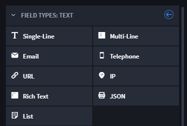

Text
====

Use a text field when you need to store textual data in a record.

|image1|

When creating a text field, you can choose from these text types:

+-----------------+---------------------------------------------------+
| Field Type      | Description                                       |
+=================+===================================================+
| **Single-line** | Use to store a single line of text.               |
+-----------------+---------------------------------------------------+
| **Multi-line**  | Use to allow more than one line of text in a      |
|                 | record.                                           |
+-----------------+---------------------------------------------------+
| **Email**       | Use to allow email address format validation.     |
+-----------------+---------------------------------------------------+
| **Telephone**   | Use to allow telephone number format validation.  |
+-----------------+---------------------------------------------------+
| **URL**         | Use to allow URL format validation.               |
+-----------------+---------------------------------------------------+
| **IP**          | Use to allow IP address format validation.        |
+-----------------+---------------------------------------------------+
| **Rich Text**   | Use to allow a rich text field editor field in    |
|                 | records.                                          |
+-----------------+---------------------------------------------------+
| **JSON**        | Use to allow JSON data to display in records from |
|                 | the results of an integration task or workflow    |
|                 | action. This is not an editable field.            |
+-----------------+---------------------------------------------------+
| **List**        | Use to allow a list of text or text strings in    |
|                 | records.                                          |
+-----------------+---------------------------------------------------+

To create text fields:

From Application Builder's Field Types, select **Text** and then drag
and drop it to the Form Layout. Drop the field in the layout area, or
within a Tab or Section layout object.

Access the field's Field Properties and complete the following fields as
needed:

+----------------+-------------------------+-------------------------+
| Field          | Step                    | Example                 |
+================+=========================+=========================+
| **Name**       | Enter the name of the   | Email Address           |
|                | field.                  |                         |
+----------------+-------------------------+-------------------------+
| **Help Text**  | Enter contextual help   | *Enter the email        |
|                | text. You will first    | address of the affected |
|                | need to specify whether | party or parties.*      |
|                | the help text will      |                         |
|                | appear above or below   |                         |
|                | the field in the record |                         |
|                | form, and then you can  |                         |
|                | enter the text.         |                         |
+----------------+-------------------------+-------------------------+
| **Required**   | Click to indicate       | *checkmark*             |
|                | whether entering data   |                         |
|                | in the field is         |                         |
|                | required to process the |                         |
|                | record.                 |                         |
+----------------+-------------------------+-------------------------+
| **Read-only**  | Click to indicate that  | *checkmark*             |
|                | the field is read-only  |                         |
|                | for the record. The     |                         |
|                | field will not be       |                         |
|                | editable. For more      |                         |
|                | information on          |                         |
|                | read-only fields, see   |                         |
|                | `Read-Only Field        |                         |
|                | Be                      |                         |
|                | havior <../../../../dev |                         |
|                | eloper-guide/read-only- |                         |
|                | field-behavior.htm>`__. |                         |
+----------------+-------------------------+-------------------------+
| **Unique**     | Click to indicate that  | *checkmark*             |
|                | the field's value must  |                         |
|                | be unique for this      |                         |
|                | record.                 |                         |
+----------------+-------------------------+-------------------------+
| **Calculated** | Click to indicate that  | *                       |
|                | the field contains a    | TOTALMINUTES([Date/Time |
|                | calculation. Calculated | Opened], [Date/Time     |
|                | fields are read-only    | Closed])*               |
|                | and the value is the    |                         |
|                | result of a calculation |                         |
|                | defined with a custom   |                         |
|                | formula. Once you       |                         |
|                | select this checkmark,  |                         |
|                | the Calculation         |                         |
|                | Expression Help opens,  |                         |
|                | and you can define your |                         |
|                | formula or function.    |                         |
|                | See `Calculation        |                         |
|                | Builder <../calc        |                         |
|                | ulation-builder.htm>`__ |                         |
|                | for more information.   |                         |
|                | This is not available   |                         |
|                | for list fields.        |                         |
+----------------+-------------------------+-------------------------+

Next, consider the following advanced options in the Field Properties
tab:

+------------------+--------------------------------------------------+
| Field            | Step                                             |
+==================+==================================================+
| **Prefix**       | Enter text that will be prepended to the field's |
|                  | input.                                           |
+------------------+--------------------------------------------------+
| **Suffix**       | Enter text that will be appended to the field's  |
|                  | input.                                           |
+------------------+--------------------------------------------------+
| **Min Items**    | Indicate the minimum number of items to allow in |
|                  | a list field.                                    |
+------------------+--------------------------------------------------+
| **Max Items**    | Indicate the maximum number of items to allow in |
|                  | list field.                                      |
+------------------+--------------------------------------------------+
| **Length Limit** | Indicate a number that will limit the number of  |
|                  | characters or words that can be inserted into    |
|                  | the field. This field is available only to       |
|                  | single-line, multi-line, and rich text fields.   |
+------------------+--------------------------------------------------+
| **Length**       | Indicate a minimum and maximum numeric value     |
|                  | that will limit the number of characters or      |
|                  | words that can be inserted into the field. This  |
|                  | field is available only to list fields.          |
+------------------+--------------------------------------------------+

Add specific field-level permissions by role, and when ready click
**Apply.**

