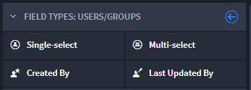
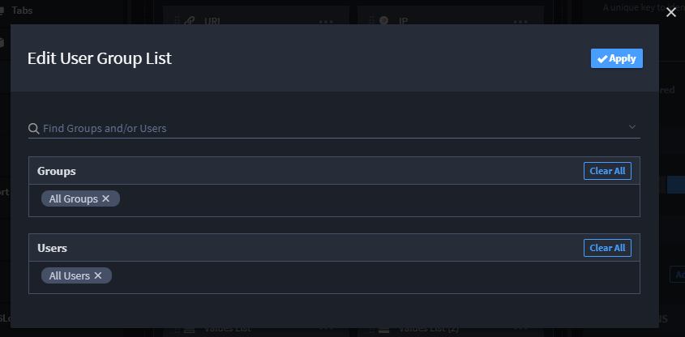

Users / Groups
==============

Use this field when you need to select from a list of users or groups.
You can select individual users or groups, or select multiple users or
groups.

|image1|

When creating a Users/Groups field, you can choose from these types:

+---------------------+----------------------+----------------------+
| Field Type          | Description          | Example              |
+=====================+======================+======================+
| **Single-select**   | Use to select one    | User: D. Groundloop  |
|                     | user or group.       |                      |
+---------------------+----------------------+----------------------+
| **Multi-select**    | Use to select one or | Groups: SOC          |
|                     | more users and/or    | Analysts, Desktop    |
|                     | groups.              | Support              |
+---------------------+----------------------+----------------------+
| **Created By**      | Use to have Swimlane | Automatically        |
|                     | specify the user     | populates with       |
|                     | that initiated the   | user's name.         |
|                     | record.              |                      |
+---------------------+----------------------+----------------------+
| **Last Updated By** | Use to have Swimlane | Automatically        |
|                     | specify the user who | populates with       |
|                     | last edited the      | user's name.         |
|                     | record.              |                      |
+---------------------+----------------------+----------------------+

To create Users/Groups fields:

From Application Builder's Field Types, select a users/groups field and
then drag and drop it to the Form Layout. Drop the field in the layout
area, or within a Tab or Section layout object.

Access the field's Field Properties and complete the following fields as
needed:

+------------------+------------------------+------------------------+
| Field            | Step                   | Example                |
+==================+========================+========================+
| **Display Name** | Enter the name of the  | *Assigned User*        |
|                  | field.                 |                        |
+------------------+------------------------+------------------------+
| **Help Text**    | Enter contextual help  | *Specify the users     |
|                  | text. You will first   | and/or groups assigned |
|                  | need to specify        | to this record.*       |
|                  | whether the help text  |                        |
|                  | will appear above or   |                        |
|                  | below the field in the |                        |
|                  | record form, and then  |                        |
|                  | you can enter the      |                        |
|                  | text.                  |                        |
+------------------+------------------------+------------------------+
| **Required**     | Click to indicate      | *checkmark*            |
|                  | whether entering data  |                        |
|                  | in the field is        |                        |
|                  | required to process    |                        |
|                  | the record.            |                        |
+------------------+------------------------+------------------------+
| **Read-only**    | Click to indicate that | *checkmark*            |
|                  | the field is read-only |                        |
|                  | for the record. The    |                        |
|                  | field will not be      |                        |
|                  | editable.              |                        |
+------------------+------------------------+------------------------+

Next, set up the users and/or groups. On the Field Properties tab, under
Advanced, click **Add/Edit Values.**

|image2|

On the Edit User Group List, add the users and groups you want to be
able to select from this field. Users and Groups must already be set up
in Swimlane Settings in order to be selected here. Click **Apply** when
you have added all of the groups and users for your field.

Add specific field-level permissions by role, and when ready click
**Apply.**

