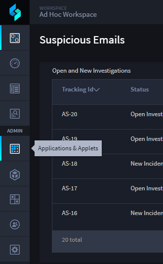
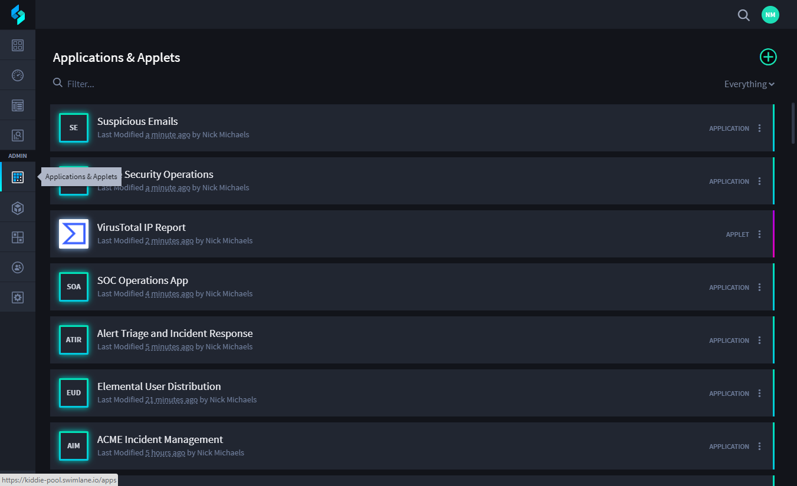
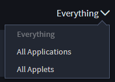
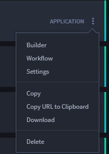

Manage Applications and Applets
===============================

The Applications and Applets home page is where you manage your
applications and applets.

|image1|

From the main page you can:

-  Create new applications and applets.
-  Edit existing application and applet content and settings.
-  Copy applications and applets.
-  Delete applications and applets.
-  View applications, applets, or both.
-  Import Swimlane solution packages.
-  Export applications and applets as Swimlane solution packages

|image2|

You can view and modify the applications and applets you have
permissions to view and modify. See
`Permissions <../permissions/permissions.htm>`__ for more information
about setting user, group, application, and field permissions in
Swimlane.

The list of applications and applets can be modified with the sort
drop-down. You can view all applications, all applets, or view
everything.

|image3|

+> **Note:** The default sort order of applications and applets lists
them by those most-recently accessed.

Each application and applet have associated actions according to your
permissions, including:

+---------------------------+-----------------------------------------+
| **Feature**               | **Function**                            |
+===========================+=========================================+
| **Builder**               | Opens Application or Applet Builder.    |
+---------------------------+-----------------------------------------+
| **Workflow**              | Opens the workflow for the application. |
+---------------------------+-----------------------------------------+
| **Settings**              | Edits the settings for the application  |
|                           | or applet, including the name,          |
|                           | description and permissions.            |
+---------------------------+-----------------------------------------+
| **Copy**                  | Creates a copy of the application or    |
|                           | applet. Rename the copy, then it is     |
|                           | added to your Applications and Applets  |
|                           | home page.                              |
+---------------------------+-----------------------------------------+
| **Copy URL to Clipboard** | Copies the URL to the clipboard so that |
|                           | you can share it with other interested  |
|                           | parties.                                |
+---------------------------+-----------------------------------------+
| **Download**              | Downloads, or exports the application   |
|                           | or applet.                              |
+---------------------------+-----------------------------------------+
| **Delete**                | Deletes the application or applet and   |
|                           | all of its associated information.      |
+---------------------------+-----------------------------------------+

Access the drop-down menu on the application or applet in order to
select one of the features in the table above.

|image4|

The menu items available from the drop-down menu depend upon the user's
permissions set for applications and applets. For example:

-  Users without update permissions set will not be able to access
   Builder, Workflow, or Settings.
-  Users without delete permissions set will not be able to access
   Delete.
-  Users without create permissions set will not be able to access Copy.
-  Users without export permissions set will not be able to access
   Download.

When you select an item on the Applications and Applets home page, the
Swimlane Builder program (either Application Builder or Applet Builder)
opens. You view, edit, and update the application or applet from it's
relative builder page.

You create new applications and applets from the main page. From the
Applications and Applets main page, click the plus menu icon |image5|,
and then select **Create a new application.**

|image6|

.. |image6| image:: ../../Resources/Images/plus-menu-apps.png
