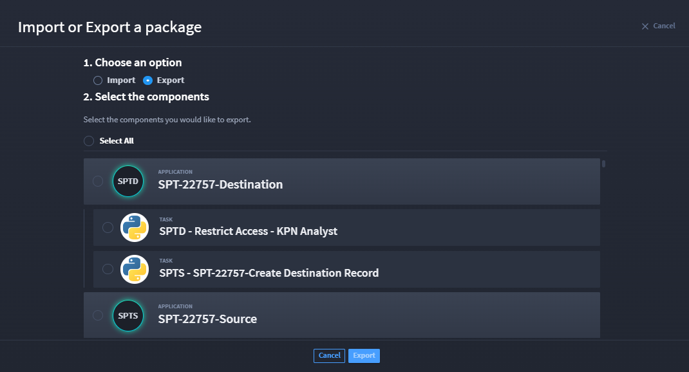
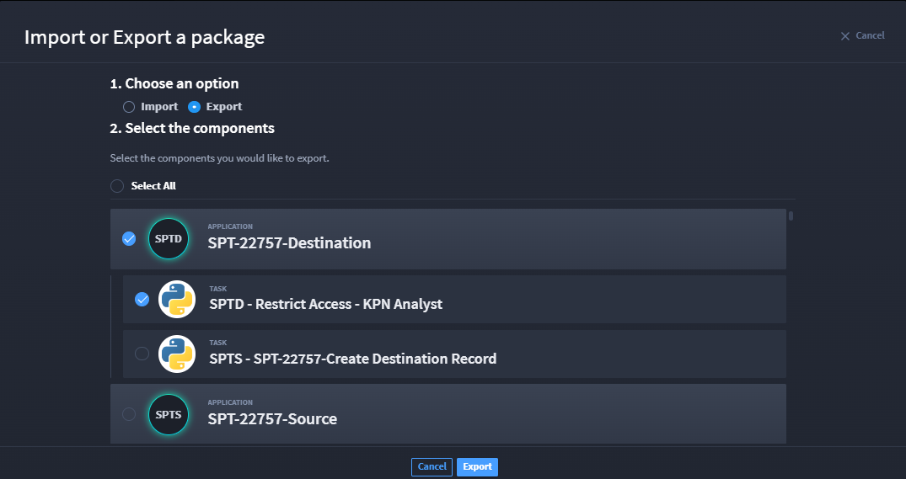
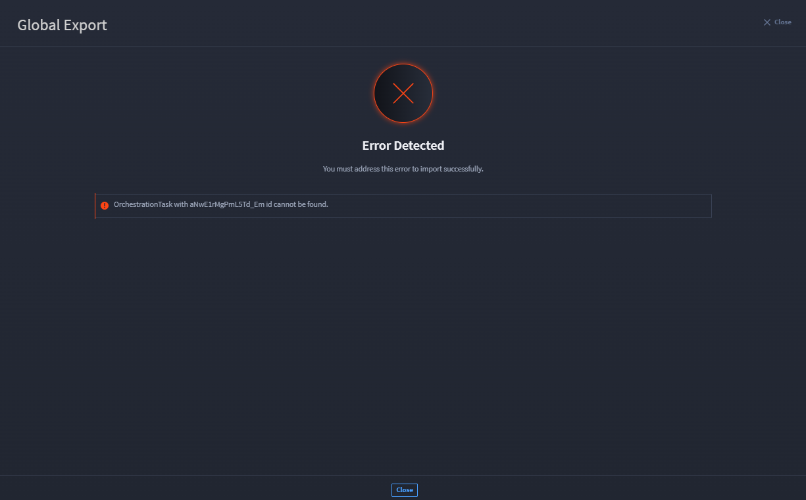
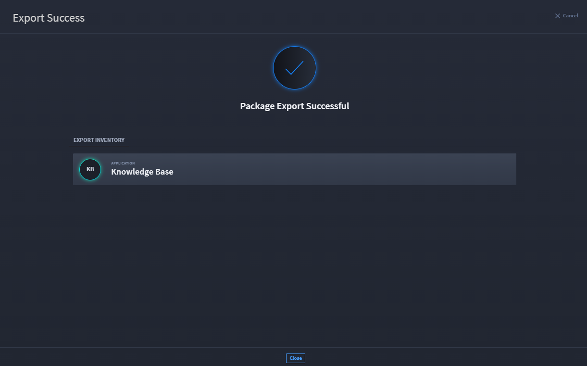

Export Swimlane Solution Packages
=================================

Export Swimlane Solution Packages (SSPs, file extention .ssp) to import
them into another instance of Swimlane. Any applications or applets you
export also contain their associated workspace, dashboard, workflow,
reports, tasks, assets, and plugins. If the application has integrations
with other applications, they will be imported as well. Applications and
applets are exported in a Swimlane solution package (.ssp) file format.

If you plan to edit your SSP file after exporting it, see `Repackage an
Unzipped SSP
File <../../../../../source-turbine/Content/swimlane-solution-packages/repackage-an-unzipped-ssp.htm>`__
to ensure your SSP imports successfully after you work on it.

**Note:** Exporting and importing SSPs can only be done by system
administrators.

Swimlane solution package exports include:

-  The initially-selected, or root application or applet
-  Any additional applications associated with the root application
-  Workflow for the root application or applet or associated
   applications
-  Reports, workspaces, dashboards or export templates for the root
   application or associated applications
-  Integrations for the root application or applet or associated
   applications (including output mappings)
-  Assets and plugins associated with any associated integration
-  Mapped inputs to key store values (the keys are removed, but you can
   add them back after import)

Components of applications that are NOT included as part of the export
are:

-  Application history
-  Records or record history
-  Secure credentials and keys (key store) which can be added later
   after import
-  Secure values in asset configurations which can be configured again
   upon import

**Note:** Exporting and importing Swimlane solution packages can only be
done by Swimlane System Administrators.

Additional Import/Export SSP features:

-  Select specific components when exporting content and import them
   into other Swimlane instances. Any context or references to other
   applications are now maintained.

-  Export multiple applications at once with the flexibility to choose
   what you want to export.

-  Existing permissions in the destination now remain intact upon
   import.

-  Provides a background job that cleans any orphaned objects that were
   created as an artifact from using other content migration tools.

Export Application SSPs
-----------------------

In Turbine, there are a few ways to export an SSP. First let's look at
how to export from the Applications & Applets main page.

#. Load the Applications & Applets main page, click the plus icon, and
   then select **Import or Export a package**.

On Import or Export a package window, step 1 has Import and Export radio
button options.

#. Click the **Export** radio button.

Turbine loads the available packages and components within those
packages to export. Step 2 allows you to select the components you would
like to export.

|image1|

#. Select the check mark next to components (i.e., reports,
   applications, etc.) that you want to export, then click **Export**.

|image2|

If a component has an error, you may receive the Error Detected
notification with an explanation. This means that component cannot be
exported successfully. Click Close and review the component with the
error to resolve.

|image3|

If you select a component and the export is successful but contains
potential issues, then you receive the a notification that provides
information about the issue. The export is still successful, and you can
click Close.

|image4|

If you select a component and there are no issues, then your package
exports successfully.

|image5|

Export from an Application
--------------------------

#. | Find the application or applet that you want to export and then,
     from the drop-down menu on the application or applet, select
     **Export**.
   | |image6|

#. Swimlane notifies you if there are potential issues that you need to
   be aware of related to your export.

#. When ready, click **Continue Export**.

.. |image6| image:: ../../../../../source-turbine/Content/Resources/Images/export-main.png
