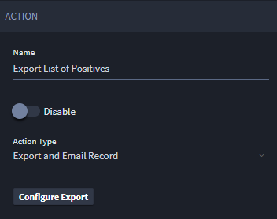
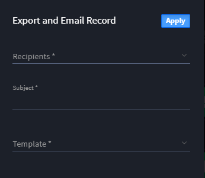

Create Export Templates from Workflow
=====================================

Export Templates can be automatically created and emailed through
Workflow actions. In Workflow, select the **Export and Email Record**
action type.

|image1|

Select **Configure Export** to define the criteria for the action.

|image2|

Select the recipients, email subject, and template to use for this
action.

