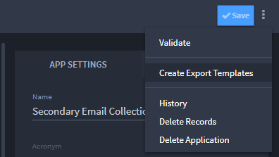
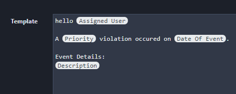
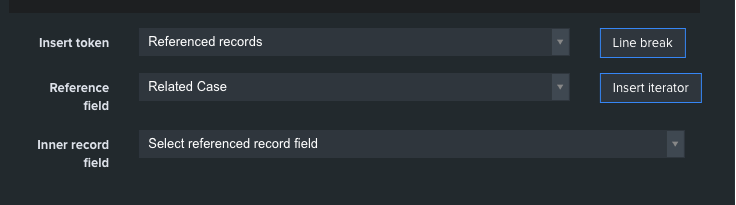

Create or Edit Export Templates
===============================

To create and manage export templates for a specific application, access
the menu from the Application Builder task bar and select **Create
Export Templates.**

|image1|

The Create Export Templates page lists all templates configured for the
Application. Edit a template by clicking the name from the list.

To create a new template, click **New Template** from the Create Export
Templates taskbar.

When authoring the template, use ``{{Field Name}}`` token syntax to
substitute values from the record at the time the template is exported.
Take the following Incident Alert template for example:

Attention {{Assigned User}} - A {{Priority}} violation occurred on
{{Date of Event}}. Event Details: {{Description}}

|image2|

You can also iterate over referenced records used in a reference field.
In the following example, *Referenced Records* is indicated as the
**Insert Token** value, which will prompt the user to select the
reference field that will be associated. The field selected in the
**Inner record field** indicates which values to output from the
records.

|image3|

