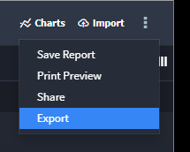
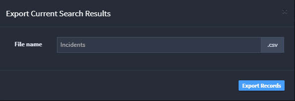

Export Records Manually
=======================

Records can be exported manually as reports from the Default Report
page.

From the Default Report taskbar pull-down menu, select **Export**.

|image1|

On Export Current Search Results, specify the template.

|image2|

Templates are downloaded as a .csv file type.

