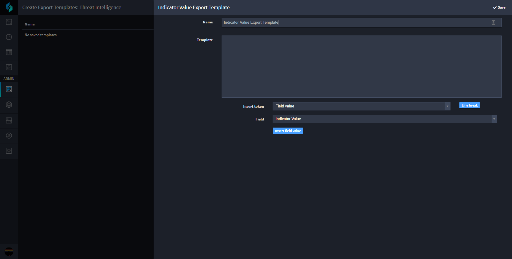

Export Templates
================

Create an export template when you need to export record data. The
export template maps field values to a predefined template. You either
download the templates manually from the Default Report view, or you can
email them with a Swimlane workflow action.

|image1|

Templates are tied to specific applications but can use referenced
fields from other applications. Export templates are useful for
exporting a record in a specific format that is consumed by a
third-party application through a mechanism such as email.

.. toctree::
   :titlesonly:
   :caption: Children:

   /Content/administrator-guide/export-templates/create-or-edit-export-templates
   /Content/administrator-guide/export-templates/export-records-manually
