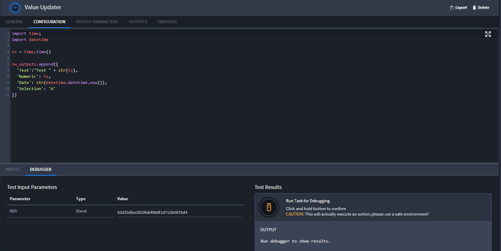
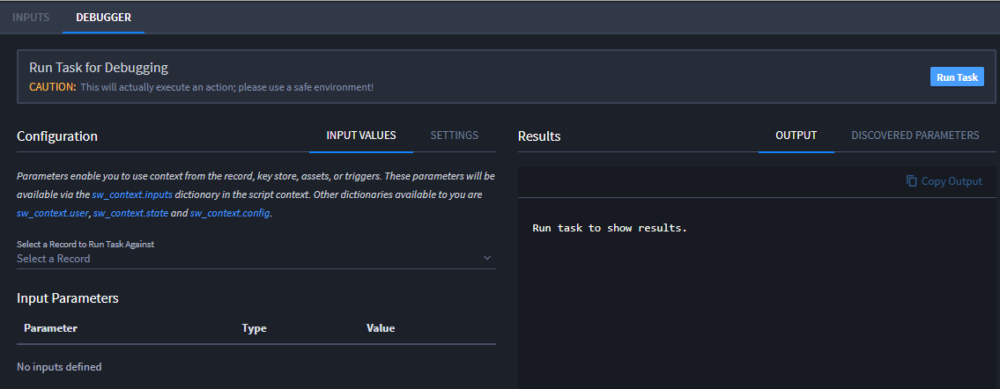
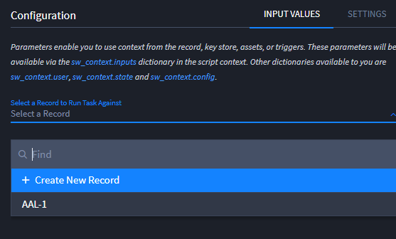
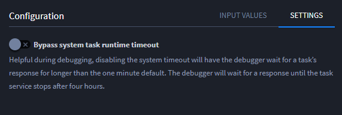
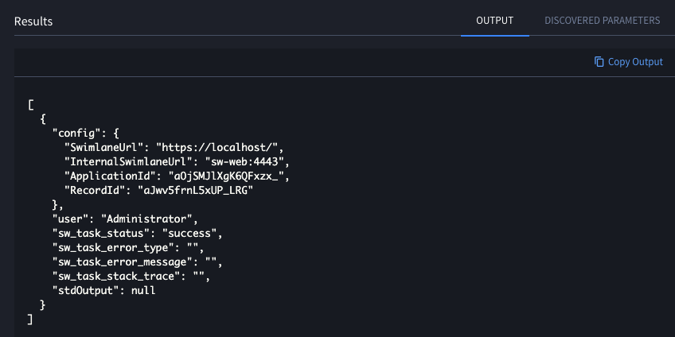
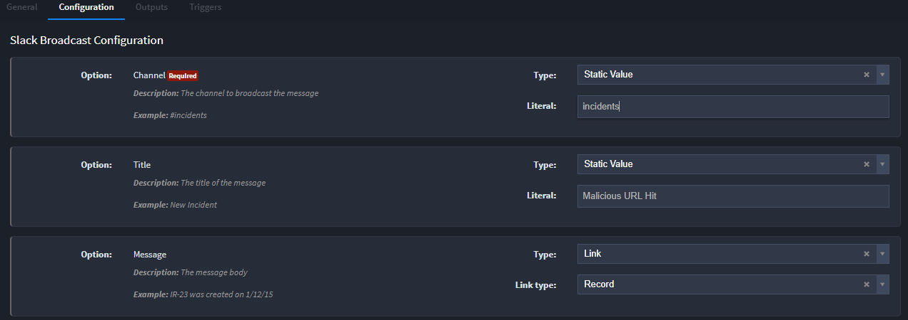
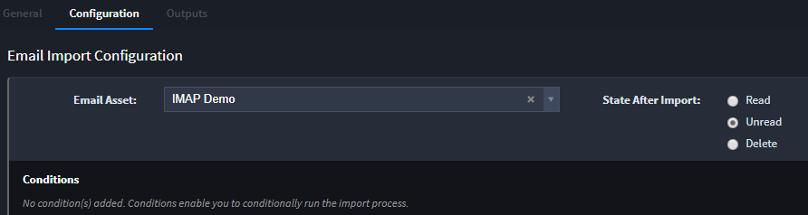
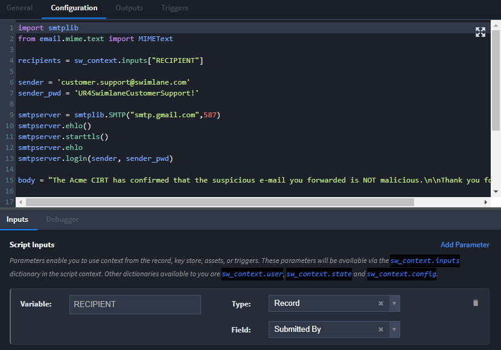
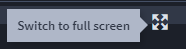

Configure Task Input
====================

Task input types and parameters contain the information that you want
your task to ingest. You configure task input parameters differently
depending upon the types of input. For example, script and API input
mapping differs from mapping input parameters for plugin or email
fields.

Map Plugin or Email Input Field Parameters
------------------------------------------

When you are configuring plugin or email fields, you are prompted to
configure with specified values. To specify the type of value, select
from the following input types:

-  **Trigger** - The task runs based on specified triggering events.

   When you select this option, the data from the trigger, for example,
   the Date Time Executed or Trigger Type, can be used as a parameter
   for the task.

-  **Record** - The task runs with fields from a specified record used
   to pass parameters to the task.

-  **Key Store** - The task runs with values from your key store. The
   values are used to pass parameters to the task. You specify the keys
   that will pass the values.

-  **Asset Library** - The task runs with values from an identified
   asset's library. The values are used to pass parameters to the task.
   You specify keys that will pass the values.

-  **Literal Value** - The task runs with a literal value you select
   that is passed to the task. For more information on literal values,
   see `Map Script or API Input Field Parameters <#Map>`__

-  **Link** - The task runs with Swimlane links as parameters.

For email fields, you can also indicate the state you want the emails to
be in after the task runs. You can select between read, unread, or
delete.

|image1|

You can set conditions for when email will import for the task. The
conditions check for text, specified in regex, in the email subject,
body, or the email sender.

**Note:** When you add more than one condition, Swimlane processes them
using AND logic.

Map Script or API Input Field Parameters
----------------------------------------

Specify script and third-party or API inputs on the Configuration tab.
The configuration of the tab varies depending up on the type of input
you are working with.

Python scripting allows you to include multiple input variables.

You can also script based on the assets available through a third party
such as Splunk, ThreatConnect, etc.

Script with String Interpolation Functionality
~~~~~~~~~~~~~~~~~~~~~~~~~~~~~~~~~~~~~~~~~~~~~~

Literal values use string interpolation functionality which allows you
to build custom strings dynamically by inserting values from record
fields and key stores. This can be very powerful for any task that
accepts a query string to search for data, or for any product endpoint
that supports a query language.

For example:

``index=swimlane AND adminkey ={{ key_store | get("passkey") }}``

``mongodbkey ={{ key_store | get("mongo_passkey") }}``

``index=swimlane AND domain={{ record | get("domain") }} AND severity>60``

Each record that triggers this task will insert the value from the
domain field into this string and pass this query string to the task.
Now each record will search the data in the swimlane index, with the
dynamic domain which has a severity greater than 60.

Swimlane supports parameter names inside quotes, with or without
characters, for example:

``{{ key_store | get("Admin's Passkey") }}``

``{{ record | get("admin_endpoint") }}``

``{{ key_store | get("Admin Passkey") }}``

``{{ record | get("admin endpoint") }}``

You can also add parameters for single-word text without quotes, for
example:

``{{ key_store | get(adminsPasskey) }}``

``{{ record | get(adminEndpoint) }}``

Swimlane also supports formatting, converting and adding/subtracting
from datetimes, as well as adding utcNow to the string interpolation for
example:

**Formatting datetime:**\ ``{{ now | format("yyyy-MM-dd hh:mm") }}``

**Converting datetime to seconds since the epoch and
epoch_ms:**\ ``{{ now | date_add(-1, d) | epoch }}``

**Adding/Subtracting datetime:**\ ``{{ now | date_add(-3, d) }}`` will
render to a datetime string representing 3 days in the past. Available
data time directives are: y, M, d, h, m, s.

**utcNow is included as**\ ``{{ now }}``

For more information about Swimlane-specific coding, see `Python Task
API <../../developer-guide/python-task-api/python-task-api.htm>`__.

Task Debugger
-------------

You can test the code in your script by running it through the Task
Debugger. In your task, click the Configuration tab. Under the script
editor, click the Debugger subtab and then click **Run Task** to check
your script.

**Note:** The Task Debugger can run against both script tasks and
built-in Swimlane tasks.

|image2|

Run the Task Debugger against existing records for application tasks in
order to pull actual values from the record's integrations. You can also
create a new record from the Task Debugger to run it against.

**Note:** The Task Debugger cannot run an applet task against a record.

|image3|

When the Task debugger is running, the **Run Task** button will change
into a **Stop Task** button. Clicking the **Stop Task** button
completely stops the debugger from running the task.

You can also bypass the system task runtime timeout by clicking the
**Settings** subtab and clicking the slider. This slider temporarily
disables the 60 second system timeout and instead has the debugger wait
for a response until the task service stop at up to four hours.

|image4|

Once the Task Debugger has completed the run, the results are shown in
the Results window of debugger. These results can be copied by clicking
**Copy Output**.

|image5|

The Task Debugger also detects available parameters. Once the Task
Debugger completes its run, click the **Discovered Parameters** subtab.
This shows the results of the parameters found during the run.

|image6|

**Note:** This utility will run your actual code so be aware of what
you've scripted when running through the debugger.

Review Task Configuration Examples
----------------------------------

The following screen shows an example of the **Configuration** tab for a
third-party plugin (or bundle):

|image7|

You configure the fields according to how the plugin is set up. Some
plugins will have many fields and options for configuration.

This screen shows an example of the **Configuration** tab for a Data
Creation task type:

|image8|

This example deals with email, which means that you will need to specify
how to handle the records after you've imported an email as part of the
task. You specify whether the email will appear read, unread, or whether
you want the task to delete the email. \\You will need to setup the task
further to have the task delete the email. You can also assign
conditions, which allow you to run import processes.

The following screen shows an example of the **Configuration** tab for a
script task type:

|image9|

The tab opens with a script editor. See `Python Task
API <../../developer-guide/python-task-api/python-task-api.htm>`__ and
`Rest API <../../developer-guide/rest-api/Rest%20API.htm>`__ in the
Swimlane Developer Guide for more information.

| You can expand the script editor to a full screen view. Click this
  icon to expand the editor:
| |image10|

To return to the Configuration tab view, with the cursor in the editor,
press **Esc.**

**Note:** The Swimlane script editor uses a variation of Python editors
like PyCharm. Swimlane's editor uses 2 spaces for a tab.

