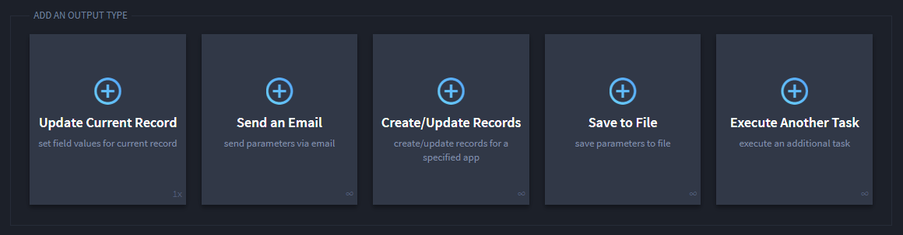
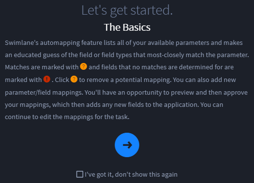

Configure Task Output
=====================

Click the Integration, **Outputs** tab to configure how Swimlane will
handle the task's output.

|image1|

To add new output, first specify the output type:

-  **Update Current Record:** Sets field values for a current record.
   This method, which modifies an existing record with the task's output
   data, must be initiated with triggers, workflow, or by manual
   integration. You can have one mapped per task.
-  **Send an Email** - Sends parameters in an email.
-  **Create / Update Records** - Creates or updates records from the
   data returned by running the task. If the task returns a sequence of
   data, you can create or update multiple data records.
-  **Save to File** - Saves to specified file.
-  **Execute Another Task** - Associates the task output to another
   task, passing the output to the next task as an input.

**Note:** Make sure that the Swimlane field and the source field type
are both set up to handle the parameters for the output!

The next steps will help you map task output data and parameters to
Swimlane fields. You can also specify specific parameters for the task's
output, for example, attachments.

|image2|

Parameter Values
----------------

You have to map, or review, parameters for output types, although
mapping can be different for each configuration.

Either you, or Swimlane's automapping process can assign parameter
values during the mapping. Some parameters such as Output Parameters and
Run Status Parameters are available for automapping. However, Standard
Output, Input Parameter, and System Output Parameters are never part of
auto-mapping and will need to be mapped manually.

For additional information on automapping, see `Map
Actions <review-discover-and-add-output-parameters.htm#map-actions>`__.

Here are the parameter values that can be assigned:

**Standard Output** - Uses the standardized stream of data produced from
your command line program or script.

**Input Parameter** - Uses your input parameters (from script or
integration data) and converts them directly to output without any
modifications.

**Output Parameter** - Uses data emitted by the task in its formal
output variables. For tasks, you can review parameters on the Output
Parameters tab. For Python script tasks, the parameters are those added
to sw_outputs as seen in the code example below. You can discover and
add scripted parameters to your tasks from the Output Parameters tab
prior to mapping them in your task. For example, here is some python
code:

ip_addr = "10.10.1.1" mac_addr = mac.getAddr()
sw_outputs.append({"IP_Address": ip_addr, "MAC_Address": mac_addr})

You can use JSONpath or JSONpath in output mapping to query objects.

For a tutorial on using JSONpath, please see the REST API Tutorial,
`JSON with JSONPath <https://restfulapi.net/json-jsonpath/>`__. You can
also utilize this `JSONpath Online Evaluator <https://jsonpath.com/>`__.
For JSONpath examples, please see `JSONpath
Examples <jsonpath-in-python-tasks.htm>`__.

For more on JSONata, see the `JSONata
Documentation <https://docs.jsonata.org/overview.html>`__ and use this
`JSONata Exerciser <https://try.jsonata.org/>`__ as a playground within
which you can test your JSONata.

**Run Status Parameters** - output parameters that contain information
about the status of the execution of the task, and any potential errors.
The following 4 parameters are available:

-  **sw_task_status** - The status of the execution. Can be either
   ``success`` or ``failure``.

-  **sw_task_error_type** - In case of failure, contains the type of
   Python exception that has been raised (i.e. ``AttributeError``).
   Otherwise, it contains an empty string.

-  **sw_task_error_message** - In case of failure, contains the Python
   error message. Otherwise, it contains an empty string.

-  **sw_task_stack_trace** - In case of failure, contains the Python
   stack trace. Otherwise, it contains an empty string.

**Example:** If you try to import a Python package that is not installed
or does not exist, the status output parameters will have the following
values:

{ "sw_task_status": "failure", "sw_task_error_type":
"ModuleNotFoundError", "sw_task_error_message": "No module named
'Swimlane'", "sw_task_stack_trace": "Traceback (most recent call
last):\\n File
\\"/app/Tasks/PythonQueue/abPE_b4d3yjYn_gSo/script.4593168CDBEB6EEB61277749AB4B6F647148CE0868314D4D675E07FF9394430D.py\\",
line 58, in <module>\\n import Swimlane\\nModuleNotFoundError: No module
named 'Swimlane'\\n", }

**Note:** Status parameters ensure that every task execution has
outputs. In some cases, this can cause empty records to be created, even
if the task did not return any other outputs. For example, if there is a
scheduled task that pulls unread emails from a monitored mailbox, it
will create a blank record even if there are no new emails to pull if
any of the status parameters are mapped.

.. toctree::
   :titlesonly:
   :caption: Children:

   /Content/administrator-guide/integrations/configure-task-output/review-discover-and-add-output-parameters
   /Content/administrator-guide/integrations/configure-task-output/map-output-for-creating-or-updating-records
   /Content/administrator-guide/integrations/configure-task-output/map-other-types-of-output
   /Content/administrator-guide/integrations/configure-task-output/jsonpath-in-python-tasks
