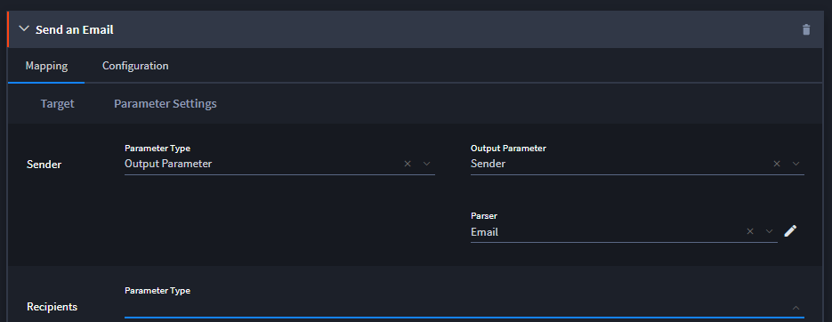
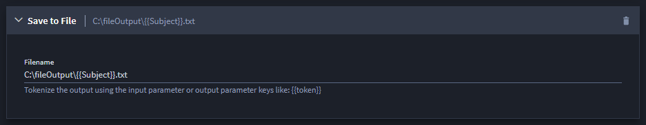
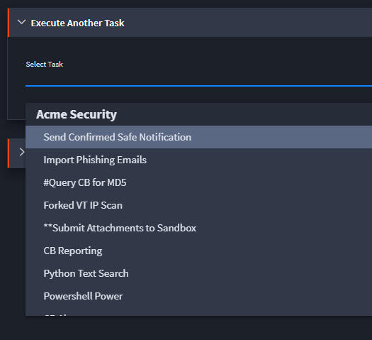

Map Other Types of Output
=========================

You can also map the output of a task to update a record in process,
send an email, save data to file, or to execute another task.

Map Output to Update Current Record
-----------------------------------

Select Update Current Record when you want a task to update a record in
process, while the task runs.

The process for mapping output to update a record in process is the same
as mapping output for creating or updating records. See `Map Output for
Creating or Updating
Records <map-output-for-creating-or-updating-records.htm>`__ for
details.

Map Output to Send in an Email
------------------------------

To map output for Send an Email:

#. From the Outputs tab, click **Send an Email**.

   |image1|

#. Review the Email Target fields, and specify the parameters from these
   options. The available parameters depend upon the email asset you
   select.

#. If applicable, indicate what you will use to parse the output data.

#. Continue with all email target fields and parameters, then click
   **Save**.

Map Output to Save to File
--------------------------

To map output for Save to File:

#. From the Outputs tab, click **Save to File**.

   |image2|

#. Specify the location where you want Swimlane to save the data, then
   click **Save**.

   **Note:** Swimlane strips invalid characters from Save to File
   output. Invalid characters include / \* ? < > " \|.

Map Output to Execute Another Task
----------------------------------

To map output for **Execute Another Task**:

#. From the Outputs tab, click **Execute Another Task**.

   |image3|

#. From the Select Task drop-down, select the task that will receive the
   current task's output as input, then click **Save**.

Note:- The outputs from one task are not automatically passed as inputs
to the triggered task. However, record field inputs or other inputs can
be defined on the triggered task to ensure that the necessary data is
available for the task to execute correctly.

