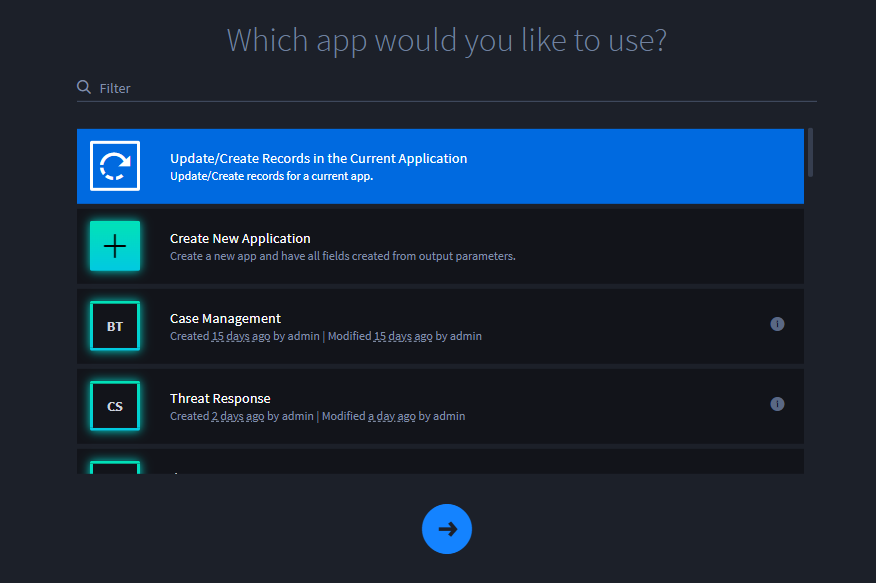
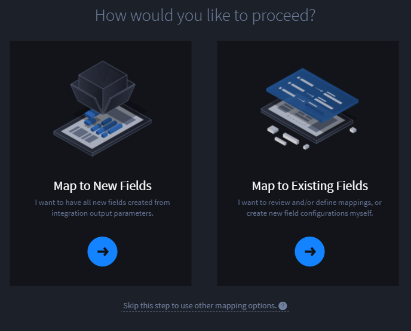
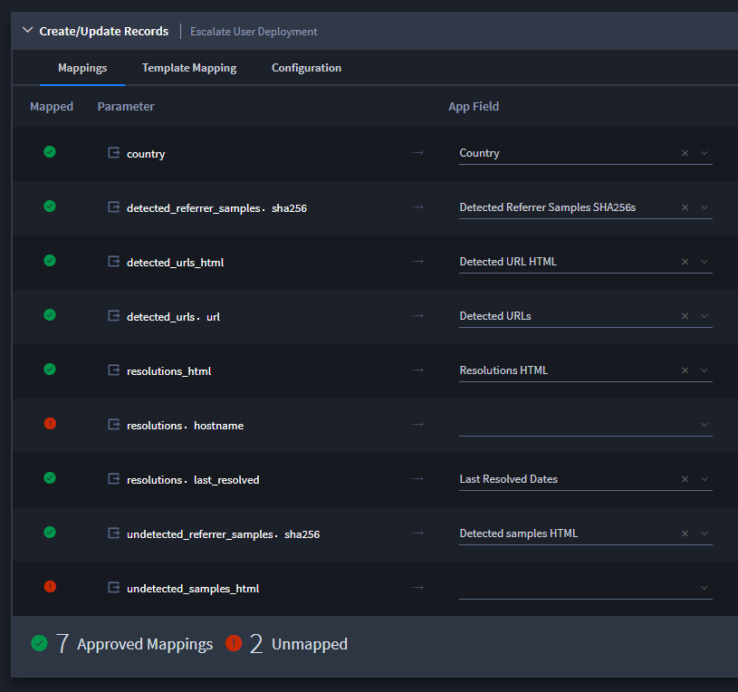
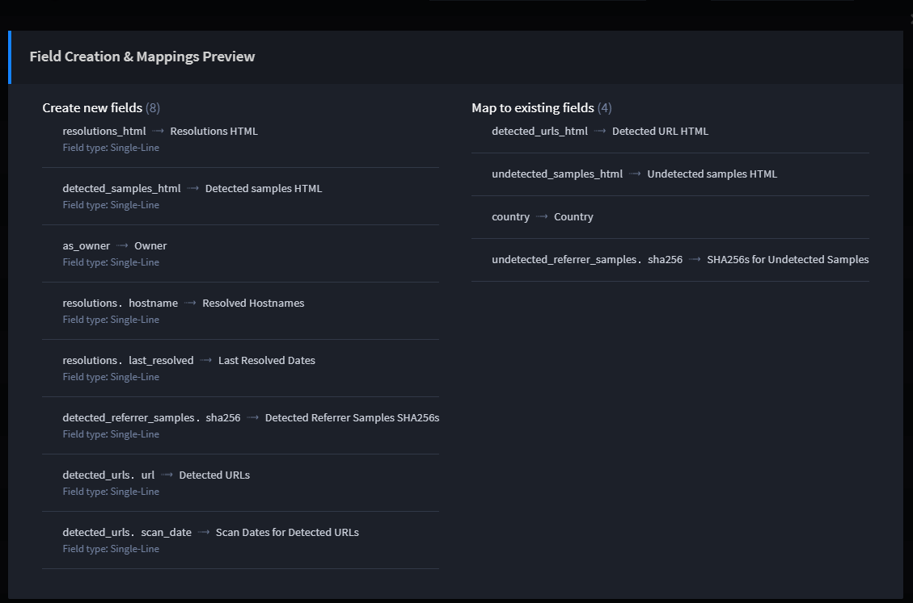
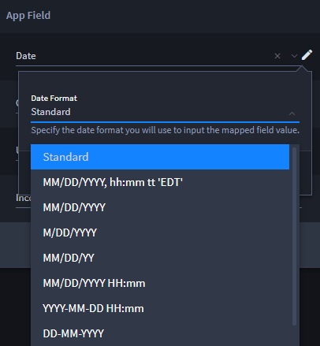
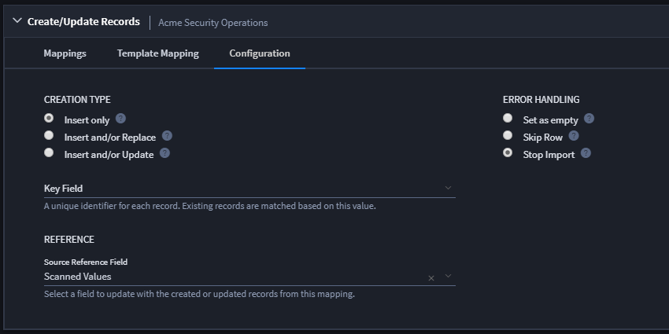

Map Output for Creating or Updating Records
===========================================

Select Create/Update Records when you have a number of fields and
parameters that you need to map for task output.

To map output for Create/Update Records or Update Current Record:

#. From the Outputs tab, click **Create/Update Records** then, on the
   next page, specify the application for the task or select
   **Update/Create Records in the Current Application**.

   |image1|

2. The first time you create a task this way, you will see this mapping
   decision dialog asking you, *How would you like to proceed?*

   |image2|

   Follow the guidance on the dialog to continue.

   Swimlane's automapping feature works to create a list of matching
   parameters and fields that you can review, configure, and approve on
   the next screen.

3. On Create/Update Records, review the suggested mappings.

4. If you want Swimlane to create a field with the output parameter and
   mapped field, enable the **Create Field** switch.

5. Select the Application Field or Field Type.

6. If applicable, indicate what you will use to parse the output data.

7.  To configure and map additional parameters, fields, or field types,
    click the ellipsis that follows the **Parse With** field and select
    **Add Configuration.**

8.  While you're working on your mappings, you can keep track with the
    mapping status bar at the bottom of the window.

    |image3|

9.  Review and save your work as you continue to create approved
    mappings. Click **Preview** to get an at-a-glance view of the
    currently updated mappings.

    |image4|

    **Note:** As you set parameters for date or user/group fields, you
    can specify the format you'd prefer that the date or name be mapped
    in the record.

    For example, you have the following options for dates/times:

    |image5|

10. Click **Add Mappings to App** to go to Approve Field Creation &
    Mappings. Review, and then click **Approve.**

11. Once you've approved your mappings, you return to the task view.
    Click **Save** to save the task.

Create an Application for Output Mapping
----------------------------------------

When mapping to create or update records, you can also create an
application on the fly and create fields to map to.

To create an application for output mapping:

#. From the Outputs tab, click **Create/Update Records** then, on the
   next page, click Create New Application.

2. Assign your application a name and other details as necessary, and
   then click **+Create.**

3. On Create/Update Records, select the **Create Field** switch to
   create fields for your application. When done, click **Add Mappings
   to App.**

Template Mapping Sub-Tab
------------------------

On the Template Mapping sub-tab, you can also specify a template at this
time, depending upon what you want the task to do. Template Mapping uses
`Mustache templating language syntax <http://mustache.github.io>`__ that
can combine multiple output values into one composite-string of text.

Here is a template example:

Malicious Scores: static analysis result: {{static_score}}, dynamic
analysis result: {{dynamic_score}}

Use ``{‌{#newline}}`` to add extra lines and/or line breaks into your
template.

Configuration Sub-Tab
---------------------

Go to the Configuration sub-tab to make further decisions about how to
update records with output from tasks. You control how the records
coming out of the task relate to the records within Swimlane by setting
the Creation Type, Error Handling, Key Field, and Reference. Hover over
the help icons on this subtab for more information, or consult this
table:

**Task Outputs Configuration Options**

+----------------------+----------------------+----------------------+
| **Configuration      | **Option**           | **Definition**       |
| Setting**            |                      |                      |
+======================+======================+======================+
| **Creation Type**    | Insert Only          | Only inserts new     |
|                      |                      | records. Does not    |
|                      |                      | update existing      |
|                      |                      | records.             |
+----------------------+----------------------+----------------------+
|                      | Insert and/or        | Creates a new        |
|                      | Replace              | record, or replaces  |
|                      |                      | an existing record.  |
+----------------------+----------------------+----------------------+
|                      | Insert and/or Update | Creates a new        |
|                      |                      | record, or updates   |
|                      |                      | an existing record.  |
+----------------------+----------------------+----------------------+
| **Error Handling**   | Set as empty         | If an error occurs   |
|                      |                      | during updating this |
|                      |                      | field, set the field |
|                      |                      | to an empty value.   |
+----------------------+----------------------+----------------------+
|                      | Skip Row             | If an error occurs   |
|                      |                      | during updating this |
|                      |                      | field, skip the      |
|                      |                      | entire record.       |
+----------------------+----------------------+----------------------+
|                      | Stop Import          | If an error occurs   |
|                      |                      | during updating this |
|                      |                      | field, stop the      |
|                      |                      | import process.      |
+----------------------+----------------------+----------------------+
| **Key Field**        |                      | The field which      |
|                      |                      | uniquely identifies  |
|                      |                      | each record.         |
|                      |                      | Existing records     |
|                      |                      | will be matched      |
|                      |                      | based on the value   |
|                      |                      | of this field.       |
+----------------------+----------------------+----------------------+
| **Reference**        |                      | If your task uses    |
|                      |                      | references, you make |
|                      |                      | additional           |
|                      |                      | specifications here. |
+----------------------+----------------------+----------------------+
|                      | Add reference on     | Click to update the  |
|                      | source record        | source reference     |
|                      |                      | field with the       |
|                      |                      | created or updated   |
|                      |                      | records from this    |
|                      |                      | mapping.             |
+----------------------+----------------------+----------------------+
|                      | Source Reference     | The source record's  |
|                      | Field                | reference field.     |
|                      |                      | This field contains  |
|                      |                      | any eligible         |
|                      |                      | reference fields     |
|                      |                      | from the source      |
|                      |                      | application that you |
|                      |                      | can select.          |
+----------------------+----------------------+----------------------+

Here's an example of the Output Mapping Configuration tab:

|image6|

