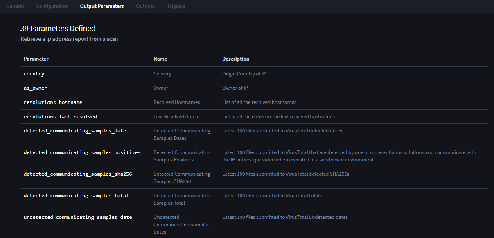
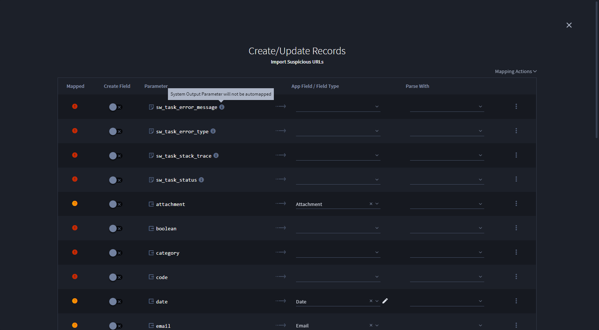
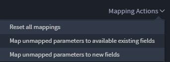
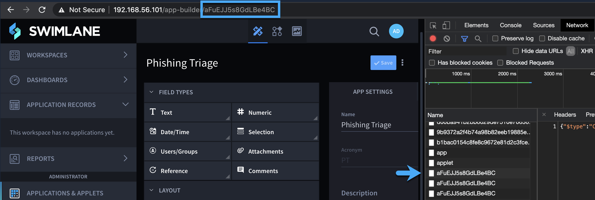
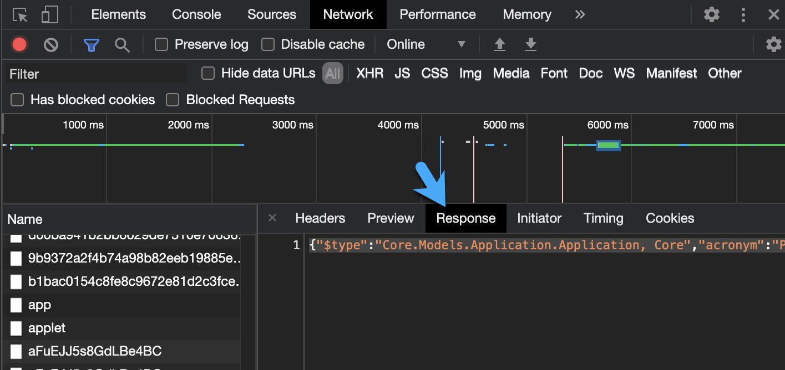
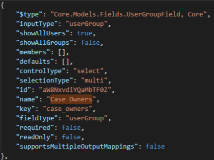
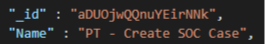

Review, Discover, and Add Output Parameters
===========================================

If your task relies on a plugin or asset, you can review the parameters,
names, and descriptions that go along with that plugin or asset on the
Output Parameters tab.

|image1|

Discover and Add Parameters for Scripted Tasks
----------------------------------------------

The Output Parameters tab is also where you review and add parameters
for scripted tasks.

**Important!** Your script must define outputs in order for them to be
discovered.

To discover and add parameters for scripted tasks:

#. Create or open a task that is dependent upon a script, then navigate
   to the Output Parameters tab. On the Output Parameters tab, click
   **Discover Parameters.
   **

2. Next, you will run the task and discover its parameters. Click and
   hold the **Run Task for Parameter Discovery** button.

3. You now have a list of defined parameters. Review the list and add
   new parameters as needed.

4. Click the Outputs tab. The parameters you've just discovered and
   added are now available to be created and mapped to in your task.

Map Actions
-----------

Swimlane helps you map your parameters. Some parameters such as Output
Parameters and Run Status Parameters are available for automapping.
However, Standard Output, Input Parameter, and System Output Parameters
are never part of automapping and will need to be mapped manually.

When you review parameters, those that are not available to be
automapped are noted with an info button that, when you hover over it,
point out the parameter's type and specify that it is not available for
automapping.

|image2|

When you are viewing the parameters in your task, or if you're viewing
unmapped parameters, you have access to the Mapping Actions menu. Click
this menu to instantly remove all existing mappings, to map unmapped
parameters to available existing fields, or to map unmapped parameters
to new fields.

|image3|

The parameters all have relative data types that are associated with
specific field types. When mapping parameters, the relevant, associated
field types are all that are listed for you to choose from. For more
detail on output mapping and field types, see `Appendix: Output Mapping
Types <../../../appendices/output-mapping-types.htm>`__.

Find Tasks That Output to a Specific Field
------------------------------------------

When troubleshooting an error, it may be helpful to find a list of all
tasks that output to a specific field.

You’ll need:

-  An application in Swimlane with a field
-  The name of the field in Swimlane
-  Google Chrome
-  `Access to
   MongoDB <https://support.swimlane.com/support/solutions/articles/8000088613-installing-robo-3t-and-running-a-query-for-mongodb>`__
   (or this link for how to `access Mongo via
   CLI <https://support.swimlane.com/support/solutions/articles/8000068326-mongodb-accessing-the-mongo-shell-and-other-cli-tools-with-ssl-or-tls>`__)

To find tasks with a specific output field:

#. Load the **Application Builder** page.

#. Open `Chrome Developer
   Tools <https://developers.google.com/web/tools/chrome-devtools>`__.

#. Select **Network** and find the Application ID from the URL of the
   current page.

   |image4|

#. Select **Response**, copy the text, and paste it into a JSON document
   viewer.

   |image5|

#. Search the document viewer for the field name.

   |image6|

#. Copy the **id** field.

#. Connect to MongoDB.

#. Paste the field id into the following query and run it:

   db.getCollection('Tasks').find({'Outputs.Mappings.Value':
   'xxxxxx'}).pretty()

#. Code similar to the following image will be returned in the JSON
   document viewer.

   |image7|

   The important fields to look at are the **\_id** and **Name** fields.

   |image8|

   Use these fields to track down the tasks in Swimlane.

.. |image7| image:: ../../../Resources/Images/code-example-task-output-field.png

