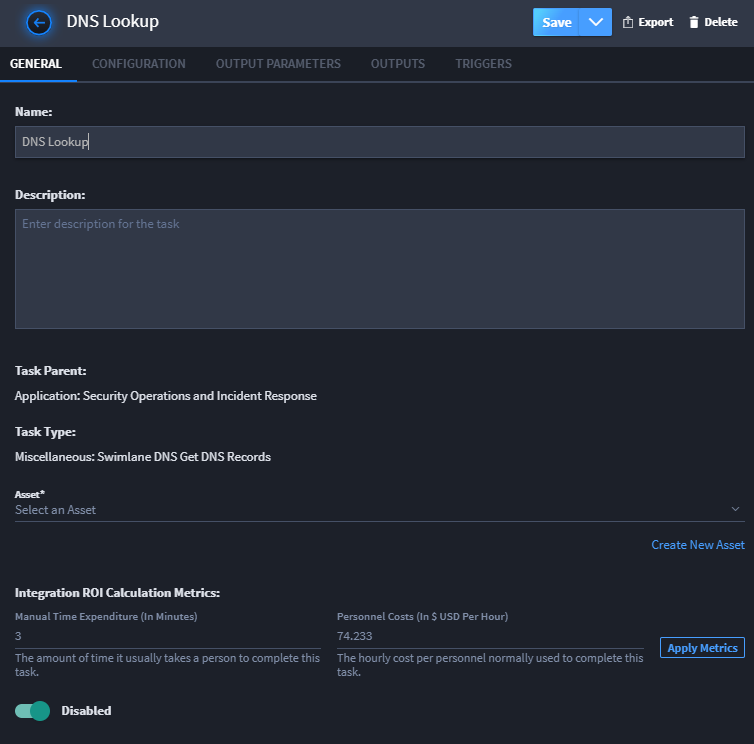
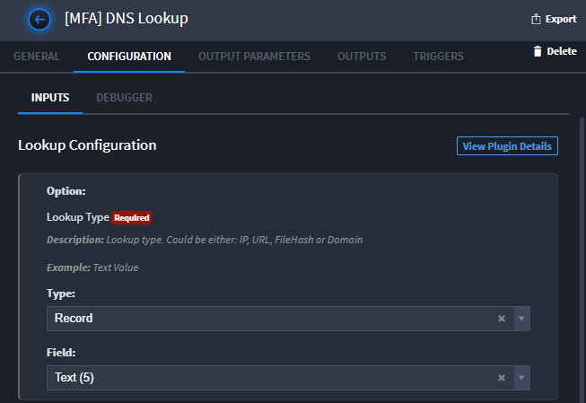
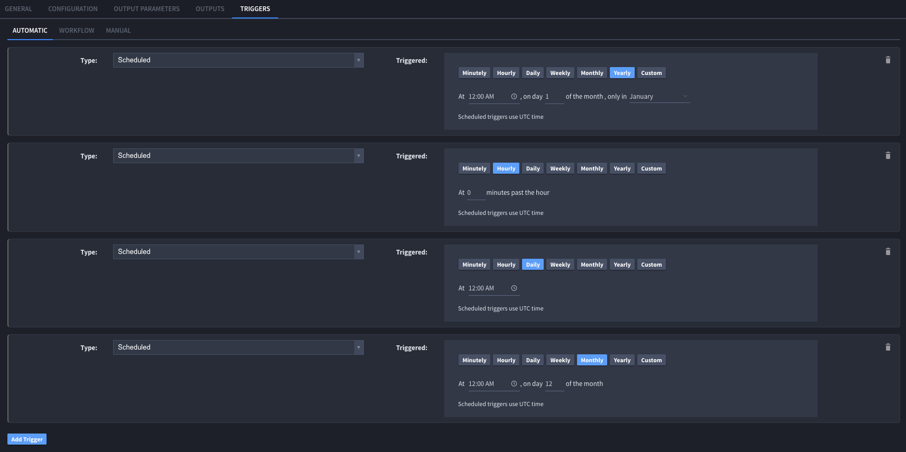

Create or Edit a Task
=====================

A Swimlane task is an action or series of actions that consist of input,
configuration details, output, and triggers. Tasks in Swimlane can be
very complex and can contain multiple input and output variables.

Use Swimlane's task creation process to fine-tune the tasks that you
want an application to run.

Create a New Task
-----------------

To create a new task:

#. From the Integrations, Tasks page, click the plus menu icon, and then
   select **Create a task**.

2. On Create a Task, Swimlane lists plugin actions. You can filter by
   vendor (on the right-side of the page), and/or type a task, plugin
   action, or vendor into the filter field. Once you find your desired
   task type, click **Create.**

3. Next, Swimlane prompts you to name your task. You can also associate
   it with a related application or applet or leave it as a common task.
   Applications and applets can only utilize common tasks or tasks
   associated with them.

3. On the Integration, **General** tab, you can rename the task, provide
   a description, select or create an asset, set the appropriate ROI
   usage metrics, and enable or disable the task. You can also see the
   task parent and the task type for each task.

   |image1|

   **Note:** By default, a task is enabled upon creation.

4. You can also set up Usage Metrics for this task. Usage Metrics track
   the time and cost you are saving by automating this task. To set
   Usage Metrics, under Integration ROI Calculation Metrics fill out the
   **Manual Time Expenditure** and **Personnel Costs** fields so that
   the value of the automation is calculated in Usage Metrics.

Configure a Task
----------------

Click the Integration, **Configuration** tab to configure the task.

The details that you configure for your task vary depending upon the
type of task that you create. Most tasks have a set of inputs that need
to be configured in a form but others, for example Python or Powershell
scripts, require a text editor.

**Note:** Here, you can also reference the plugin details for the plugin
that is associated with the task by clicking **View Plugin Details**.

|image2|

In addition, you configure the outputs as well. Swimlane's automapping
helps you step through the process of output mapping.

For detailed information about input and output configuration see:

-  `Configure Task Input <configure-task-input.htm>`__
-  `Configure Task
   Output <configure-task-output/configure-task-output.htm>`__

**Note:** Swimlane tasks work best when they are short-lived jobs that
can be quickly executed. Tasks will timeout and be terminated by the
system after 4 hours. When a task times out another execution of the
same task is queued to replace it.

Set Triggers
------------

Click the Integrations, **Triggers** tab to specify the conditions that
will cause this task to run.

Tasks can be triggered by the following conditions:

-  **Scheduled** - Task runs by a specified time frame.
-  **Email** - Task runs when a specified email is received.
-  **Record Save** - Task runs whenever a specified record is saved in
   the associated application.
-  **Integration** - Task runs when an integration runs.

You can also schedule a custom trigger with a valid cron expression.

|image3|

Tasks can be referenced from workflow or from an integration button in
Swimlane's Application Builder. The Workflow tab shows any workflow
actions that are associated with the current task. Click **Add/Edit
Workflow** to associate a task with a new workflow action. The Manual
tab displays any layout objects associated to the task in Application
Builder. Click **Open Application Builder** to edit the application.

**Note:** Tasks that are triggered by an integration to update a
specific value in a record are set to only affect the value once. This
was designed so that integration record value changes do not run in a
continual loop.

Set Scheduled Trigger
~~~~~~~~~~~~~~~~~~~~~

#. In your task, go to **Triggers** and select the trigger type
   **Scheduled**.

#. Select how often you would like the task triggered. You can specify
   minutely, hourly, daily, weekly, monthly, yearly, or custom.

3. Click **Save**.

Set Email Trigger
~~~~~~~~~~~~~~~~~

To set up an email trigger, you must have an email or IMAP asset, an
application with text fields, and a configured task.

#. In your task, go to **Triggers** and set the trigger type to
   **Email**.

#. Select the asset you would like to use to trigger the task.

3. Under **Configuration**, click **Add Parameter**.

4. Add any necessary manipulation in the python code.

5. Under **Outputs**, add the output type **Create/Update Records**.

6. Select the application and click **Map to Existing Fields**.

7. Map the parameters to a text field. These parameters should show up
   on the outputs page.

8. Click **Save**.

Set Record Save Trigger
~~~~~~~~~~~~~~~~~~~~~~~

To set up a record save trigger, you must have your task associated with
an application.

#. In your task, go to **Triggers** and set the trigger type to **Record
   Save**. This will trigger the task every time a record is saved.

#. Click **Save**.

Set Integration Trigger
~~~~~~~~~~~~~~~~~~~~~~~

To use an integration trigger, you must have two tasks that you want to
use.

#. In your first task, go to **Outputs** and click **Execute Another
   Task**.

#. Click the arrow next to **Execute Another Task** to expand the
   section. Select your second task. This second task will trigger once
   the first task is complete.

#. Click **Save**.

