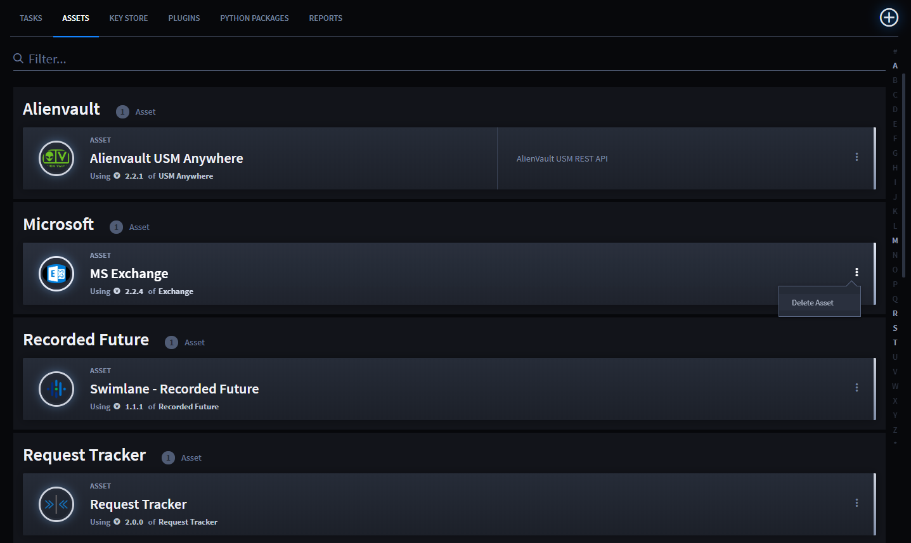
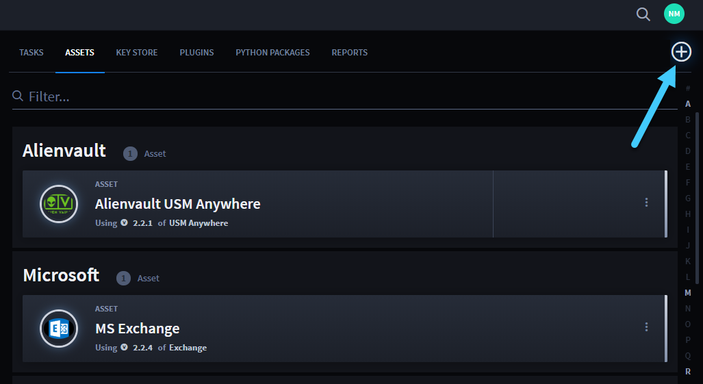
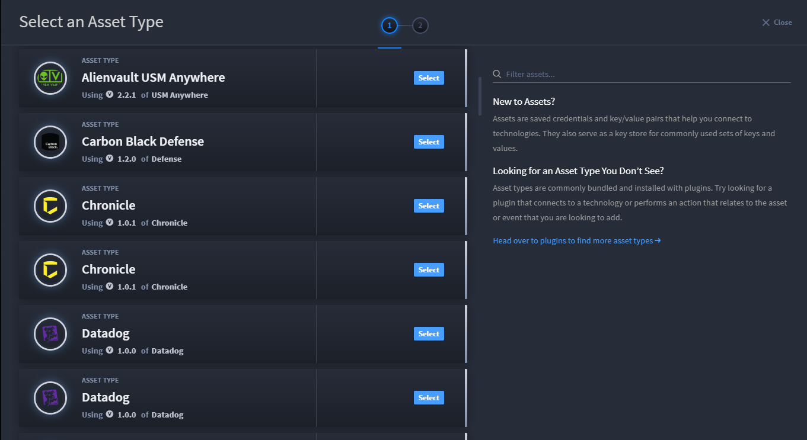
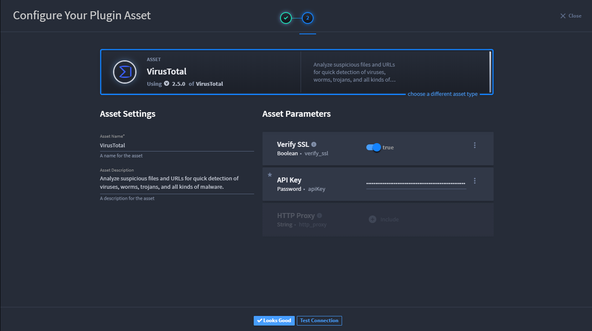
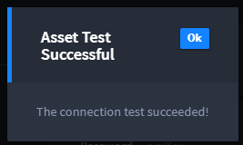
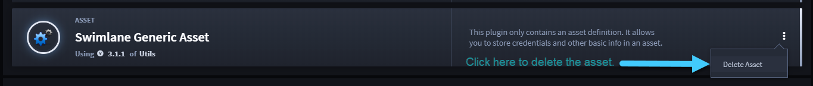
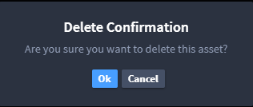

Create or Edit an Asset
=======================

Assets are reusable, structured, and product-specific objects that
contribute to the success of Swimlane tasks by handling secure
authentication and configuration specifications for external systems.

On the Integrations, **Assets** tab, you can view the assets that you
have already set up. If you can't find a specific asset, consider
looking through your uploaded plugins. You might need to upload a plugin
that has the asset type that you are looking for.

|image1|

Create a New Asset
------------------

To create a new asset:

#. On the Integrations, Assets tab, click the plus menu icon.

   |image2|

#. On Select an Asset Type, review the available asset types. Once you
   find the plugin asset you need, click its **Select** button.

   |image3|

   You can filter the assets to narrow your search.

#. On Configure Your Plugin Asset, set the asset's parameters. You can
   also edit the existing **Asset Name** and **Asset Description**, as
   needed.

   |image4|

   If the parameters you set on the asset include any API key or other
   connective details, you can test the active connection of the asset
   within Swimlane.

#. Click **Test Connection** and ensure you get the resulting "Asset
   Test Successful" message.
   |image5|

5. On Configure Your Plugin Asset, click **Looks Good**.

   Once an asset is configured, it can be used with any new or existing
   task.

Edit an Asset
-------------

To edit an asset:

#. On the Integrations, **Assets** tab, locate the existing asset.

#. Access the Asset Management page by clicking near the name of the
   asset.

3. Now you can edit the parameters or asset name or description. Test
   the connection as necessary and then click **Looks Good**.

Delete an Asset
---------------

To delete an asset:

#. On the Integrations, **Assets** tab, locate the asset.

#. Click the ellipsis menu on the asset that you want to delete, and
   select **Delete Asset**.
   |image6|

3. | On the Delete Confirmation dialog, click **Ok**.
   | |image7|

