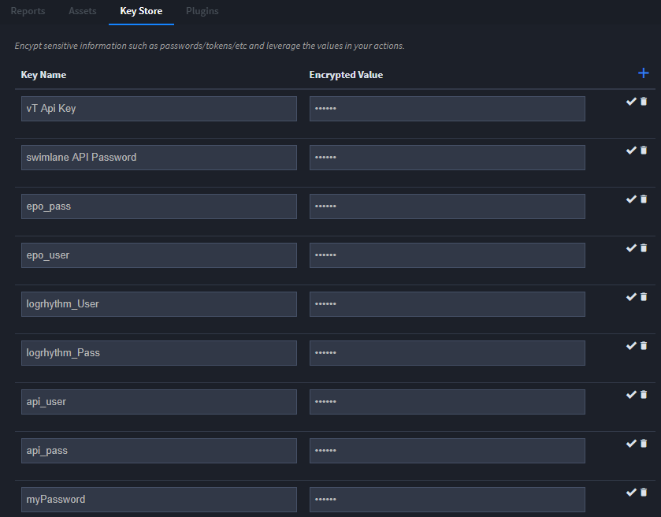
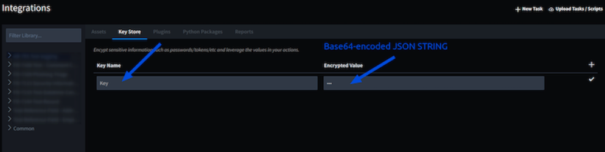

Create or Edit the Key Store
============================

Use the Key Store to encrypt sensitive information such as passwords,
tokens, etc., and leverage the values in your actions.

|image1|

From Integrations, click the **Key Store** tab. To add a key, click
**+** on the tab. New fields appear at the bottom of your list of keys.
Complete the **Key Name** and **Encrypted Value** fields and then click
the checkmark to save the key record.

Enter as many key and value pairs as needed.

**Note:** The values are encrypted in Swimlane's database.

Store API Tokens and Keys for Integration Scripts
-------------------------------------------------

Swimlane provides a Key Store that may be used for integration API
tokens and keys. Even custom keys for custom integration scripts may be
stored in the Key Store.

#. Base64-encode the token/key as a JSON string.

#. On the Key Store page in the Integrations UI, give the key a name in
   the **Key Name** field (**Key** in the example below), and insert the
   base64-encoded JSON string in the **Encrypted Value** field.
   |image2|

3. In your integration scripts, refer to the key by the name you gave it
   like this: 

   ``key = sw_context.inputs['Key']``

