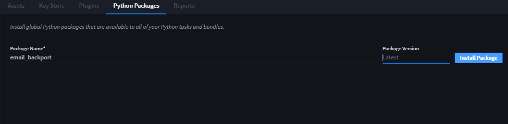
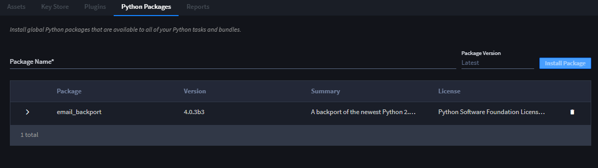
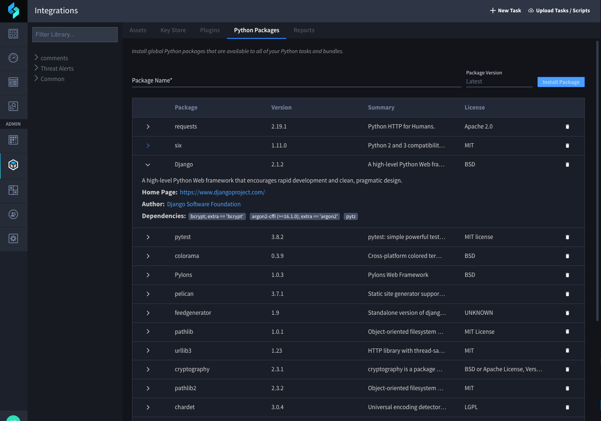
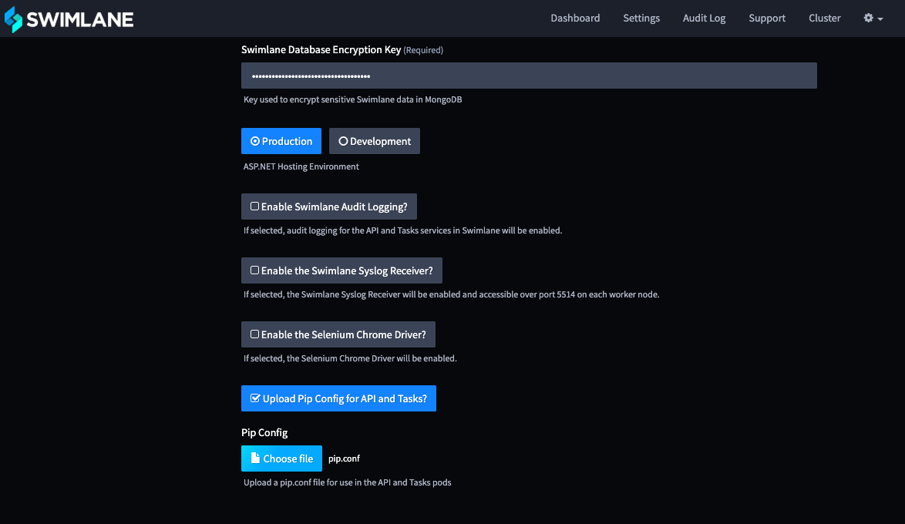
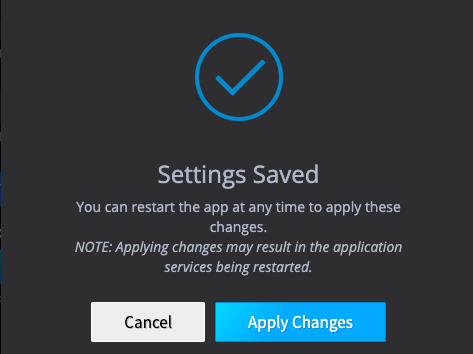

Install and Manage Python Packages (for Linux Swimlane Installations)
=====================================================================

If you have a Linux Swimlane installation, you are able to view and
access the Python Packages tab from the Integrations page. Use the
Python Packages tab to install and manage global Python packages that
are available to all of your Python tasks and plugins.

+> **Note:** If you cannot see the Python Packages tab from the
Integrations page, you are working on a Windows installation of
Swimlane.

To install python packages:

#. Click Package Name and type the name of a Python Package.

|image1|

**Tip!** Use the Python Package Index, or `PyPI <https://pypi.org/>`__,
as a resource for package names.

2. Specify a version of the package, and then click **Install Package**.

If you do not specify a version, the latest version is installed.

3. Verify that the package is installed.

|image2|

Swimlane does not allow you to install two versions of the same package
at the same time.

Python packages are listed in order of installation. Expand a package to
see additional detail about it.

|image3|

To uninstall a package, click the trash can icon.

Configure a Private PIP Repository
----------------------------------

You can install pip packages from a private repository for:

-  Standard Linux environments
-  HA Kubernetes environments
-  HA Kubernetes with Helm environments

+> **Note:** You have an HA Kubernetes with Helm environment if you set
up your environment manually and without the Swimlane installer
dashboard.

Standard Linux Environment
~~~~~~~~~~~~~~~~~~~~~~~~~~

Use the following steps if you need to install pip packages from a
private repository in a standard Linux Swimlane environment.

#. Create a pip.conf file in the ``/opt/swimlane/.secrets`` folder with
   the following:

::

   [global]
   index-url = https://<localMirrorURL>
   extra-index-url=https://pypi.org/simple
   trusted-host = <trustedDomain>
   proxy = http://<proxyURL>
   no-cache-dir = no

+> **Note:** The extra-index-url and proxy settings are optional.

2. Modify your sw_api and sw_tasks entries in docker.compose.yml to
   mount the pip.conf file as a volume:

::

   sw_api:
    volumes:
    - /opt/swimlane/.secrets/pip.conf:/home/swimlane/.pip/pip.conf
   sw_tasks:
    volumes:
    - /opt/swimlane/.secrets/pip.conf:/home/swimlane/.pip/pip.conf

3. Restart Docker from ``/opt/swimlane/``:

``docker-compose stop``

``docker-compose up -d``

HA Environment
~~~~~~~~~~~~~~

Use the following steps if you need to install pip packages from a
private repository in an HA Swimlane environment.

#. Open the Swimlane installer dashboard.

#. From the dashboard home page, select Settings.

#. On Settings, select **Upload Pip Config for API and Tasks?**

   |image4|

#. Click **Choose File** and upload a pip.conf file with the following:

::

   ```
       [global]
       index-url = https://<localMirrorURL>
       extra-index-url = no
       trusted-host = <trustedDomain>
       proxy = http://<proxyURL>
       no-cache-dir = no
   ```

   +> **Note:** The extra-index-url and proxy settings are optional.

5. On Settings, click **Save.**

6. The Settings Save dialog opens, click **Apply Changes.**

|image5|

7. Next, you'll need to restart your instance of Swimlane. From the main
   page of the install dashboard, click *Stop Now*, wait for the
   application to stop, and then click *Start Now*. This restart is
   required at this time.

HA Kubernetes with Helm Environment
~~~~~~~~~~~~~~~~~~~~~~~~~~~~~~~~~~~

You have an HA Kubernetes with Helm environment if you set up your
environment manually and without the Swimlane installer dashboard. Use
the following steps if you need to install pip packages from a private
repository in a Helm-deployed, Kubernetes HA Swimlane environment.

+> **Note:** To export your values, use this command:
``helm get values <helm release> > <filename>.yaml``

#. Modify the .yaml by adding the following:

::

     pipConfig:
     name: pip-config
     config: |
       [global]
       index-url = https://<localMirrorURL>
       extra-index-url = no
       trusted-host = <trustedDomain>
       proxy = http://<proxyURL>
       no-cache-dir = no

+> **Note:** The extra-index-url and proxy settings are optional.

3. Next, upgrade helm.

``helm upgrade <helm release> swimlane/swimlane -f <filename>.yaml``

+> **Note:** swimlane/swimlane = organization/chart name

4. Restart pods.

``kubectl scale deployments <helm release>-swimlane-tasks --replicas=0``
``kubectl scale deployments <helm release>-swimlane-tasks --replicas=3``
``kubectl scale deployments <helm release>-swimlane-api --replicas=0``
``kubectl scale deployments <helm release>-swimlane-api --replicas=3``






