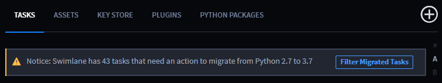
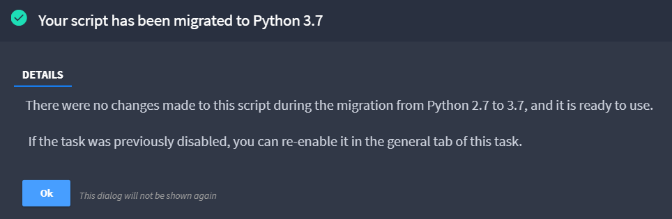
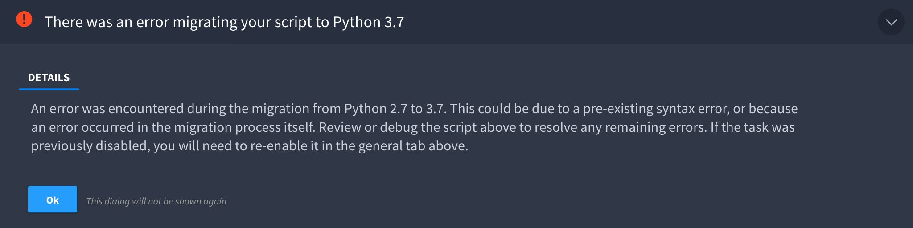
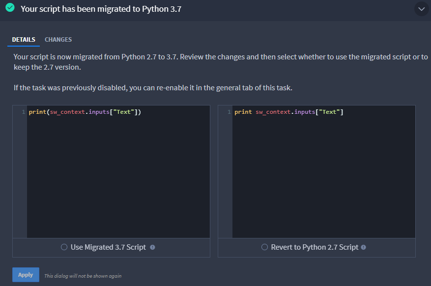
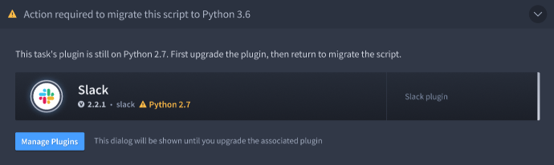

Python Task Migration
=====================

As of the 10.5.0 release of Swimlane, Python 2 is no longer supported.
Therefore, all Python 2 tasks must be migrated to Python 3 to be
enabled. Swimlane 10.5.0 includes the Python Migrator that converts all
Python 2 tasks to Python 3 scripts using the provided Python library.
These migrated tasks are disabled and require review before being
enabled once again.

To review and enable migrated tasks, from the Integrations page click
**Filter Migrated Tasks** to see the migrated tasks that require action.

|image1|

There are four situations that can occur for these migrated tasks: no
changes in script, error in migration, review of migrated script, or
Python 2.7 plugin.

No Changes in Script
--------------------

On the task **Configuration** tab, a dialog informs you that no changes
were made to the script during the migration process. Click **Ok**.

|image2|

Make sure to run the task in the **Debugger** and enable the task in the
**General** page before clicking **Save**.

Error in Migration
------------------

In the task **Configuration** tab, a dialog informs you that there was
an error migrating the script. This requires you to migrate the script
manually. Click **Ok** and update the script.

|image3|

After updating the script, make sure to run the task in the **Debugger**
and enable the task in the **General** page before clicking **Save**.

Review of Migrated Script
-------------------------

In the task **Configuration** tab, a dialog informs you to select to
**Use Migrated 3.7 Script** or to **Revert to Python 2.7 Script**. If
you approve the changes, select **Use Migrated 3.7 Script**. If you do
not approve the changes, select **Revert to Python 2.7 Script**. Once
the choice is selected, click **Apply**.

|image4|

**Note:** If you select **Revert to Python 2.7 Script** you will have to
manually update the syntax of your script.

After you apply the changes, make sure to run the task in the
**Debugger** and enable the task in the **General** page before clicking
**Save**.

Python 2.7 Tasks
----------------

In the task **Configuration** tab, a dialog informs you that the task's
plugin needs to be upgraded. Click **Manage plugins** to be taken to the
**Plugins** page.

|image5|

Upgrade the plugin and return to the task to continue the migration
review.

