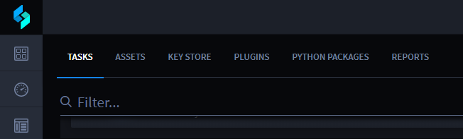
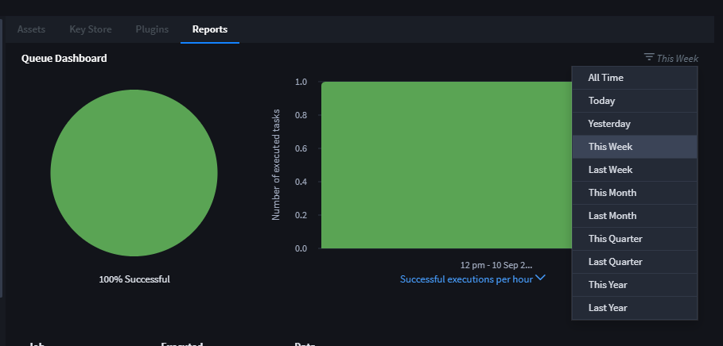

Reports
=======

As your tasks begin to run, data will begin to show in the reports you
have set up.

To view reports, from the Integrations taskbar, select the Reports tab.

|image1|

Use the pull down to select the time frame for the reports.

|image2|

