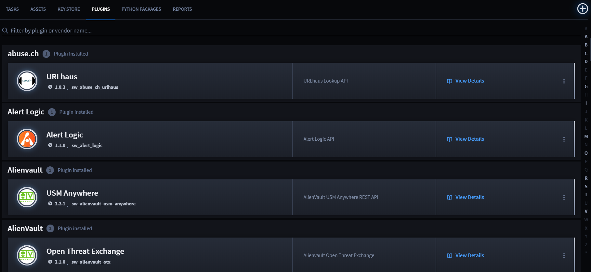
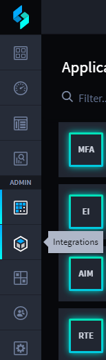
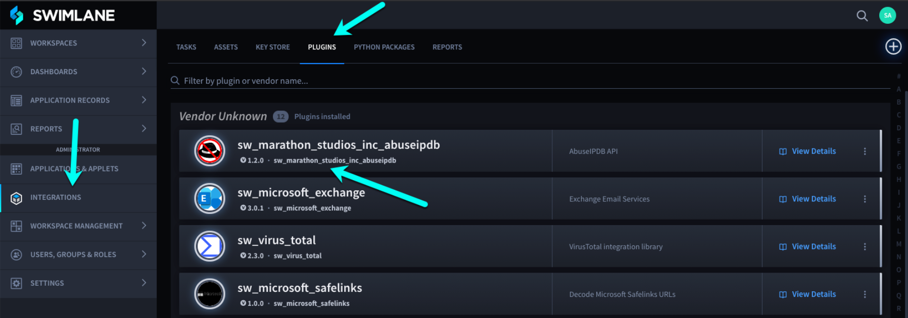
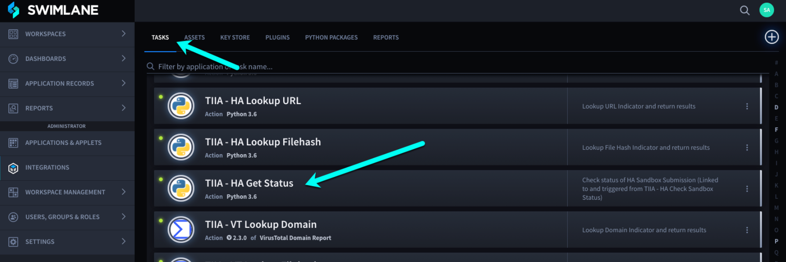
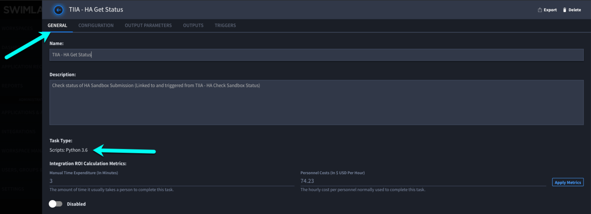
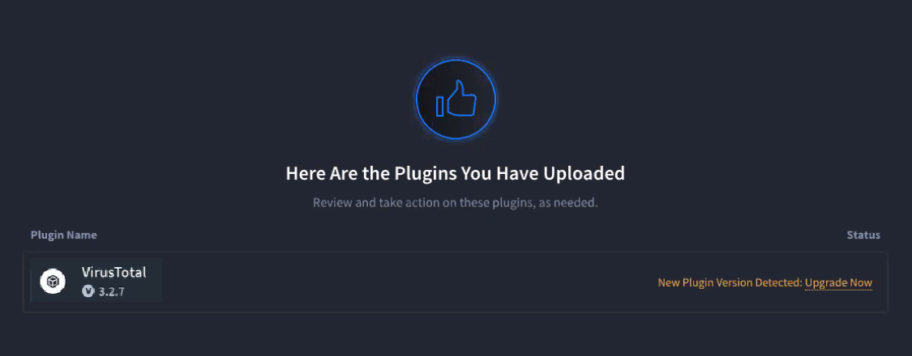
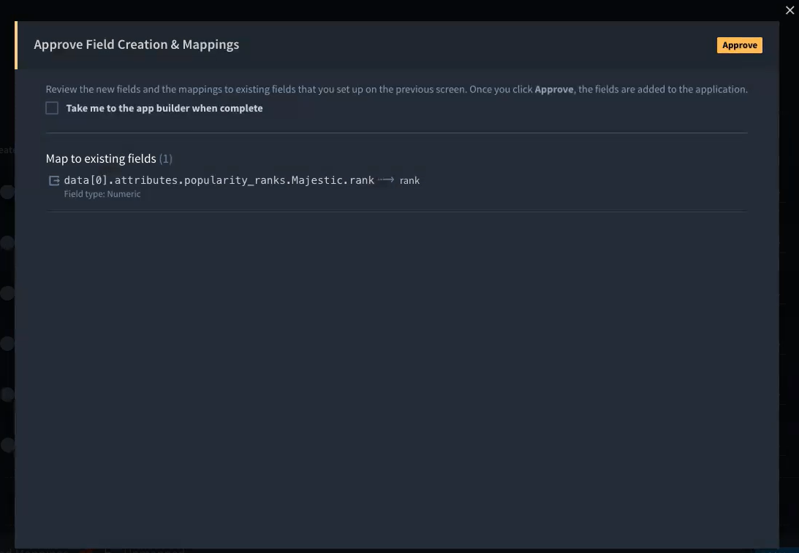
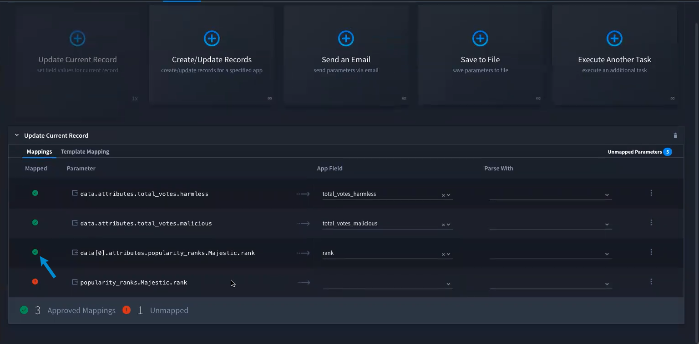
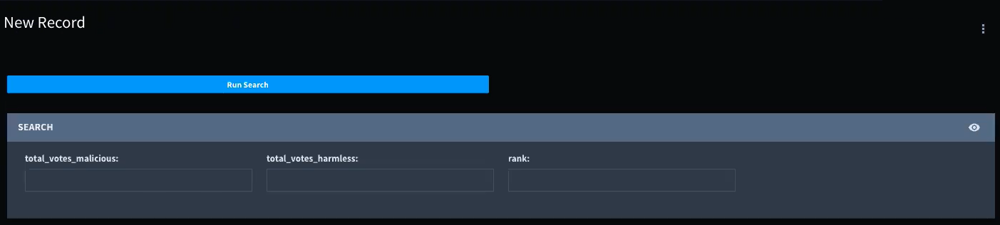

Upload and Manage Plugins
=========================

Plugins enable you to perform out-of-the-box integrations with
third-party vendors.

To view installed plugins, from the Integrations page, click the
**Plugins** tab.

|image1|

Upload Plugins
--------------

To upload a new plugin:

#. | From the global navigation menu in Swimlane, select
     **Integrations**.
   | |image2|

2. From the Integrations taskbar, click the **Plugins** tab and then
   click the plus menu icon.

3. In the Upload Plugins dialog, drag and drop the plugin files or click
   **Browse** to locate and select the plugin files.

Identify the Version of Installed Plugins
-----------------------------------------

You can identify the plugin by either of the following two methods.

Locate the version of the plugin in the list of installed Plugins.

|image3|

Locate the version of the plugin in the list of Tasks.

|image4|

Click on the related Task and see the Plugin version under Task Type.

|image5|

Upgrade Plugins
---------------

When uploading a newer version of a plugin, if a breaking issue is
detected the status on the Upload Plugin dialog indicates that a new
plugin version has been detected. This allows you to upgrade the plugin
to the new version without losing previously defined tasks, assets, and
configurations. If no breaking change is created by the upgrade, the
plugin automatically upgrades without any additional input.

|image6|

To upgrade a plugin:

#. Click **Upgrade Now** to the right of the plugin.

2. Click **Continue Upgrade**.

3. A dialog opens stating "You are about to upgrade a plugin which will
   create breaking issues." Click **Ok**.

4. Click **Resolve # Issues** to the right of the item.

5. To resolve issues associated with a task/asset, navigate to the
   broken parameter.

6. Click **Discover Parameters**.

7. On Discover Parameters, click **Run Task** to display the discovered
   parameters' input values.

8. Select the parameters that the application alerted, and then click
   **Add Selected Parameters**.

9. Click **Unmapped Parameters** to verify the unmapped parameter.

10. Click **Add Mappings to App**.

    |image7|

11. Click **Approve** to add the new fields to the application.

    |image8|

    The parameter is updated, which shows as mapped.

    |image9|

12. Click **Save**.

13. Close out of the remaining screens, navigate back to **APPLICATION
    RECORDS**, and select the desired application and add a new record.
    The new field is available.

14. To test the record, click **Run Search**.

    |image10|

    The search runs successfully!

Delete Plugins
--------------

To delete a plugin:

#. On the plugin, click the ellipsis menu and select **Delete Plugin**.

2. Click **Delete Plugin**.

3. A dialog opens stating "You are about to delete a plugin. This will
   create breaking issues." Select **Delete Plugin**.

.. |image7| image:: ../../Resources/Images/add-mappings-to-app.png

