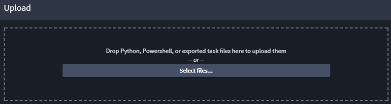
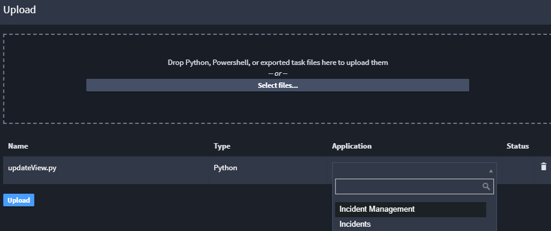

Upload Scripts and Tasks
========================

To import existing Python or Powershell scripts to Swimlane, click
**Upload Tasks/Scripts** on the Integrations toolbar and then follow the
instructions in the UI.

|image1|

Next, you assign the script or task to an application, and then click
Upload.

|image2|

The content of the script is then used to create a task of the same type
as the script. Uploaded tasks (for example, .json files) are recreated
as a task within the specified application.

**Note:** Be aware that you might need to further configure the task to
handle inputs and outputs after uploading.

Previously exported tasks can also be uploaded.

