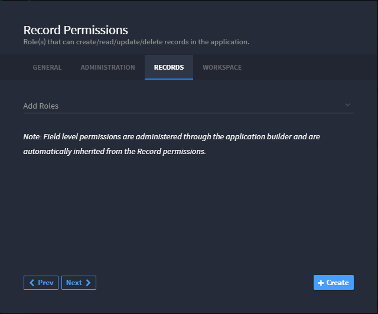
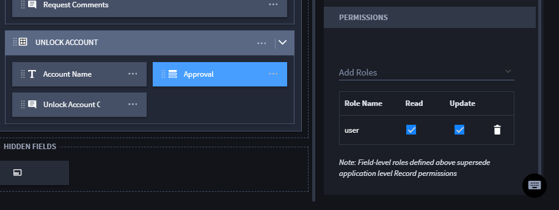
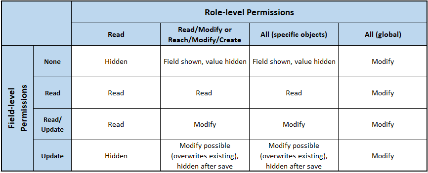

Field-level Permissions
=======================

Field-level permissions are administered through Application Builder and
are automatically inherited from Record Permissions applied at the
application level.

From the application settings, click Record Permissions and then select
the roles you want to allow access to the application's records in **Add
Roles**.

|image1|

Roles can also be given permissions to individual fields within an
application. From the Application Builder, select the field from the
application layout and then, in the Field Editor, go to Permissions.

|image2|

Roles with read permissions will be able to view but not edit the
selected field. Update permissions allow the user to edit the field.
Roles with no permissions set will not be able to see the selected field
on the record page.

|image3|

