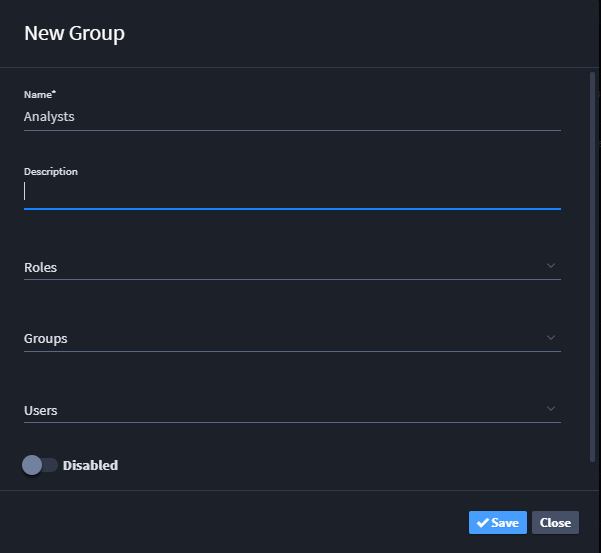

Group Permissions
=================

Administrators manage Swimlane groups. To access the Groups page, from
the global navigation menu, hover over the **Users, Groups, and Roles**
icon, and then select **Groups**.

|image1|

Administrators can create new groups and also access users and roles
from the icons on the User page taskbar.

|image2|

Manage a group by clicking on the group name, or create a new group by
clicking **New Group**.

|image3|

After completing the required fields, the administrator can add users
and/or other groups to the current group.

Disabling this group disables their permissions.

.. |image1| image:: ../../Resources/Images/group_perms.png

