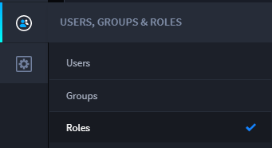
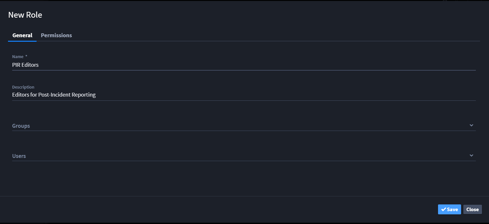
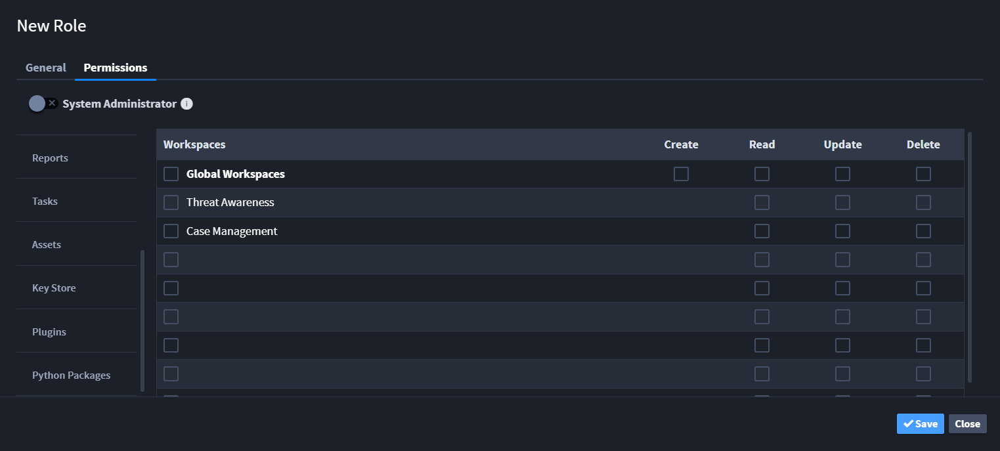
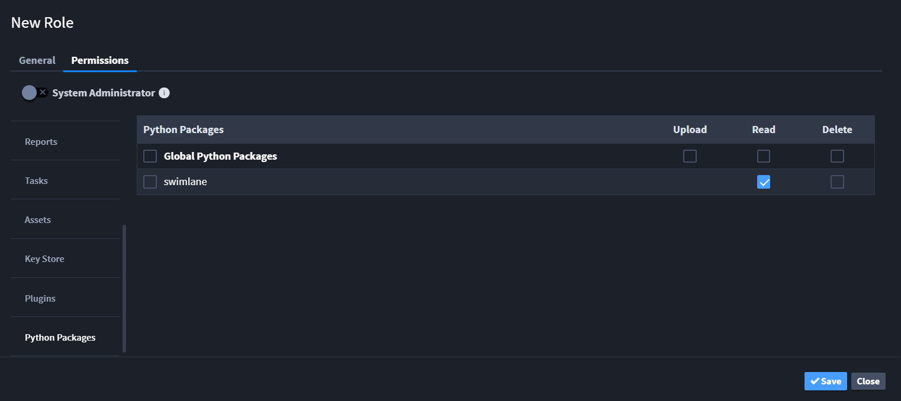
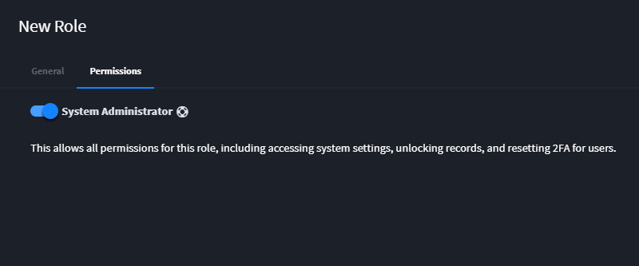

Role Permissions
================

Administrators manage Swimlane roles. To access the Roles page, from the
global navigation menu, hover over the **Users, Groups, and Roles**
icon, and then select **Roles**.

|image1|

Manage a role by clicking on the role name, or create a new role by
clicking **New Role**.

|image2|

Assign the name for the role, and enter an optional description. Then
assign groups and users associated to this role.

|image3|

On the Permission tab, set permissions for each object by type and
function. Clicking the box to the left of the name of each module will
automatically select all available functions (Create, Read, Modify,
Delete). You can set role permissions here for Workspaces, Dashboards,
Applications, Applets, Records, Reports, Tasks, Assets, Key Store,
Plugins, and Python Packages. These granular permissions allow you to
create specific, powerful roles.

|image4|

|image5|

If you want to set System Administrator permissions for the role, enable
the System Administrator toggle. This allows all permissions for this
role. Since the role now has all permissions, the module table
disappears.

|image6|

Select the Global option to allow the role access to all of the items
within the selected module.

When the "Share" permission is selected for Reports / Dashboards, user
would be able to Schedule, Email and Download the Report / Dashboard.

|image7|

You can also restrict specific roles from viewing records and record
history. On the Permissions tab, select **Record**. Find the record(s)
you want to restrict from this role, and click the Restrict Record box.
Users with that role will not be able to view the record or it's
workflow history.

Refer to this table for more information about how role permissions and
field-level permissions work together:

|image8|

.. |image7| image:: ../../Resources/Images/image%20(3).png
.. |image8| image:: ../../Resources/Images/permissions_table.png
