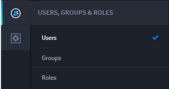
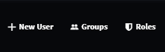
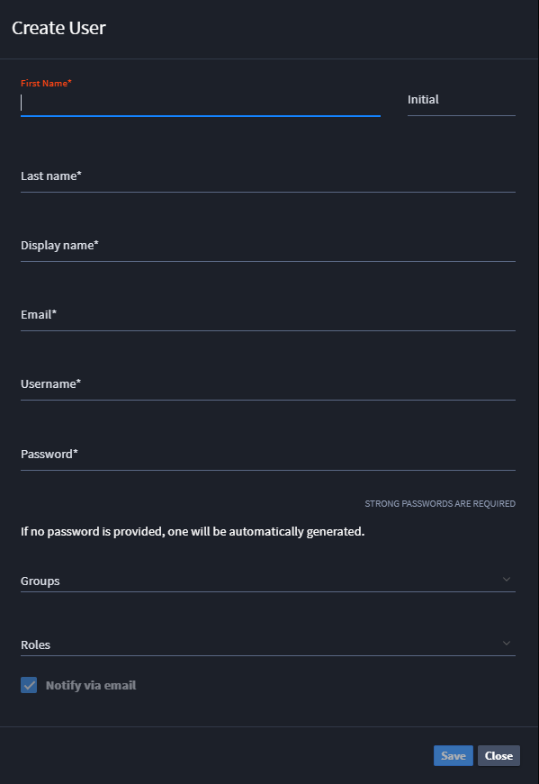
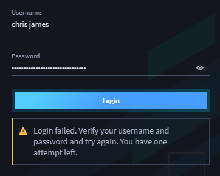
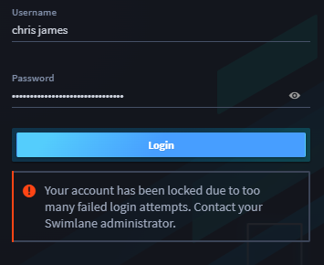
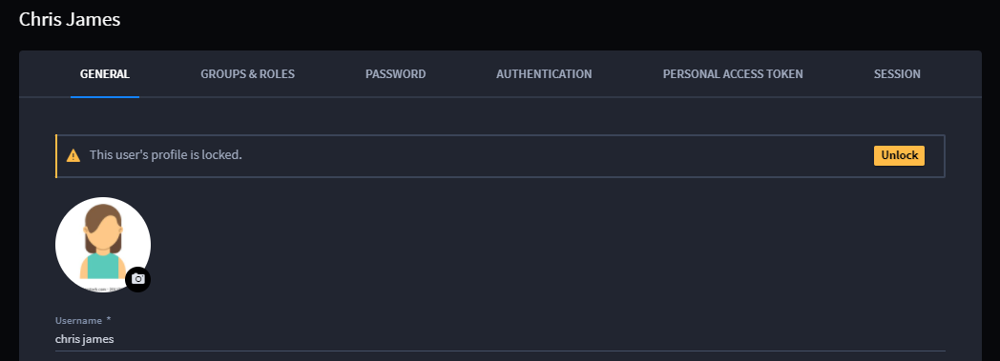
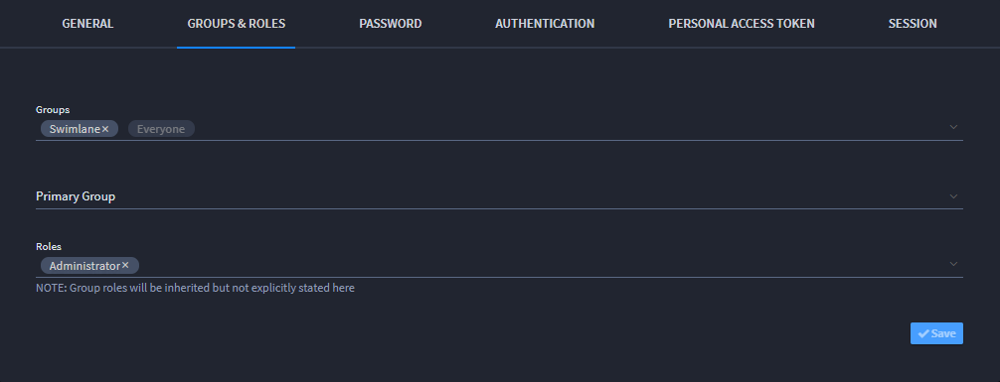

User Permissions
================

Administrators manage Swimlane users. To access the User page, from the
global navigation menu, click **Users, Groups, and Roles** icon, and
then select **Users**.

|image1|

Administrators can create new users and also access groups and roles
from the icons on the User page taskbar.

|image2|

Create a new role by clicking **New Role**.

|image3|

After completing the required fields, the administrator can:

-  Assign roles
-  Reset passwords
-  Disable accounts

Individual users are locked out of Swimlane after the number of failed
attempts specified (3 - 10) in Sessions & Security, Password.

|image4| |image5|

The Swimlane administrator is responsible for unlocking the user profile
and prompting the user to reset their password. The locked out user and
the Swimlane administrator indicated in Swimlane Settings, Sessions and
Security, Passwords both receive email notifications of the lockout.

|image6|

Swimlane recommends that the Swimlane administrator click the user's
Password tab, select **Autogenerate new password** and then click **Send
Message.**

|image7|

To manage an existing user's permissions, on the User page, click their
name. This opens their User Profile page. Access the Groups & Roles tab
to assign that user to specific groups and roles.

|image8|

**Note:** Users who do not have permissions set on any applications, but
have global permissions set in all other areas of Swimlane, will be able
to view applications and applets in the Administrator menu. If users
have global permissions for applets, they will be able to edit applets.
However, since they do not have any permissions set for applications,
they will see applications listed, but will be unable to edit them or
otherwise modify them.

.. |image7| image:: ../../Resources/Images/resetPassword.png

