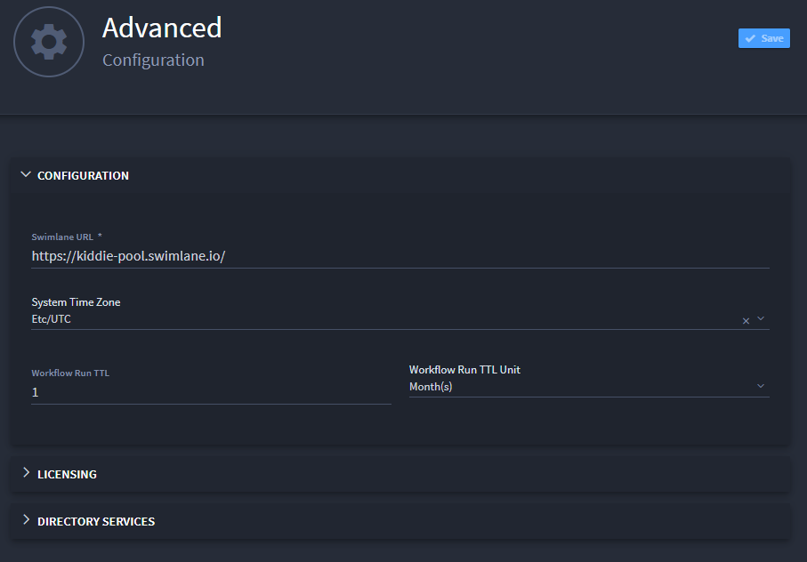

Configuration
=============

On Configuration, specify the URL that users will use to access
Swimlane. This URL is included in links back to Swimlane, as well as to
integrations.

You also specify the system-wide time zone here. Select the time zone
from the **System Time Zone** drop-down menu. The default system time
zone configuration is etc/UTC standard.

The system time setting tracks the timestamps of integrations, workflow,
tasks, and user activity and interaction with Swimlane.

|image1|

**Note:** Users and administrators can also set custom time zones from
within their User Profile settings. This custom, or local time zone
primarily affects record creation and updates.

