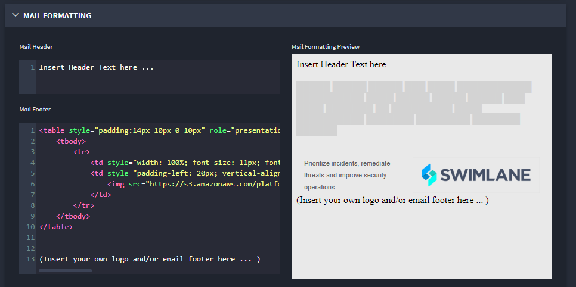

Email and PDF Settings
======================

Use Swimlane's Email and PDF Settings to specify an outgoing email
server and to customize the emails sent from Swimlane.

On Email and PDF Settings, click **>** to expand OUTGOING EMAIL SERVER.
From here you can select your preferred email authentication method,
either OAuth 2.0, Basic, or None.

Setting Up OAuth 2.0 Authentication
-----------------------------------

To set up OAuth 2.0 authentication:

#. From the **Authentication Method** drop-down, select *OAuth2 For
   Exchange/M365*.

#. On **Username**, specify the outgoing mail user.

#. On **Client ID**, include the ID value associated to your
   application.

4. Next, enter the **Client Secret** and the **Tenant ID**.

5. Enter the proxy to use for Microsoft Graft requests in the **HTTP
   Proxy** field.

6. Once you have entered the required authentication fields, click
   **Test Connection** to ensure a connection exists.

Setting Up Basic Authentication
-------------------------------

To set up basic authentication:

#. From the **Authentication Method** drop-down, select *Basic*.

#. Next, specify the outgoing mail host and port.

#. On **Username** and **Password,** specify the administrative outgoing
   mail user and their associated password.

#. To specify the outgoing email address, enter it in the **From Email**
   field.

#. Click **Disable Certificate Validation For Outgoing** to disable SSL
   certificate validation for email server testing or untrusted
   self-signed certificates.

Setting Up Without an Authentication Method
-------------------------------------------

To set up without an authentication method:

#. From the **Authentication Method** drop-down, select *None*.

#. Next, specify the outgoing mail host and port.

#. Click **Test Connection** to ensure a connection exists.

#. To specify the outgoing email address, enter it in the **From Email**
   field.

#. Click **Disable Certificate Validation For Outgoing** to disable SSL
   certificate validation for email server testing or untrusted
   self-signed certificates.

Formatting Outgoing Mail
------------------------

To format outgoing mail:

Click **>** to expand Mail Formatting, where you can customize the
emails sent from Swimlane.

|image1|

The text editor windows on the Mail Formatting page include tools that
you can use for rich text formatting of the email header and footer
content. You can delete the sample html text from Swimlane in the Mail
Footer window.

**Important!** Remember to host all source images you include in the
headers or footers on a web server that the recipients of the email can
access.

