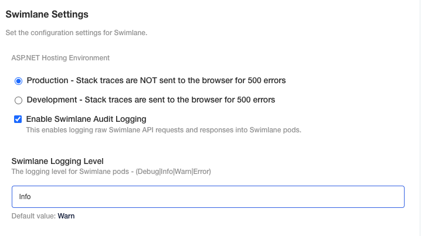

Logging
=======

You can view Swimlane logs on the Swimlane Settings, Logging page.

You control the level at which logs are reported. Logging levels are
progressive in the order seen in the table below. For example, if you
have set the logging level to Info, you will receive the logging details
for the Info level, as well as those for Debug, Warn, and Error. If you
have set the logging level to Warn, you will only receive the logging
details for Warn and Error.

Logging levels include:

+---------------+-----------------------------------------------------+
| Logging Level | What the level includes:                            |
+===============+=====================================================+
| **Info**      | Audit information such as when and what user saved  |
|               | or updated an application or record and all levels  |
|               | below                                               |
+---------------+-----------------------------------------------------+
| **Debug**     | Detailed internal system information used for       |
|               | problem resolution and all levels below             |
+---------------+-----------------------------------------------------+
| **Warn**      | Warnings and all levels below                       |
+---------------+-----------------------------------------------------+
| **Error**     | Errors when something does not complete             |
|               | successfully                                        |
+---------------+-----------------------------------------------------+

**Note:** Use the messages from logs when contacting Swimlane support
regarding an error.

Viewing Logs
------------

To view logs:

#. From the navigation menu, click **Logging.**

2. On Logging, the log data displays.

+------------------+--------------------------------------------------+
| Log Item         | Description                                      |
+==================+==================================================+
| Timestamp        | Lists the date and the time of the logged event. |
|                  | Hover over the timestamp to see the server and   |
|                  | local/user time of the logged event.             |
+------------------+--------------------------------------------------+
| Level            | Displays the logging level of the event.         |
+------------------+--------------------------------------------------+
| Message          | Displays the Swimlane message for the logged     |
|                  | event.                                           |
+------------------+--------------------------------------------------+
| Expanded Message | Expands the view of the Swimlane message.        |
+------------------+--------------------------------------------------+
| Jump to Date     | Opens a calendar from which you can select a     |
|                  | specific date to view logs from.                 |
+------------------+--------------------------------------------------+
| Filter by Level  | Allows you to filter the logs by level. You can  |
|                  | select more than one level.                      |
+------------------+--------------------------------------------------+
| Fetch            | Fetches the latest logs.                         |
+------------------+--------------------------------------------------+

.. _configuring-environment-variables-for-logging-levels:

Configuring Logging Levels
--------------------------

You need to update the configuration for your deployment in order to set
the levels for logging. Configuration is done via the SPI Admin Console.

To configure environment variables for logging levels:

#. Navigate to the SPI Admin Console and open the Configuration tab.

#. Navigate to the Swimlane Settings section on the Configuration page
   and update the Swimlane Logging Level text field. By default, the
   value is set to Warn. See the logging levels table above for more
   information about how levels report back as logs.

   | 
   | |image1|

#. Optionally, enable audit logging. It is required that the Swimlane
   Logging Level is set to Info so that all audit logs show up.

#. Navigate to the bottom of the page and save your changes, you will be
   prompted to deploy the new configuration immediately or you can
   deploy it in the Version history tab at a later point in time. In the
   Version history tab, the latest sequence ID should correspond to the
   sequence ID shown on the pop up when you save the configuration
   changes.

Using an External API to Forward Logs
-------------------------------------

As an orchestrator, sometimes you may need to forward Swimlane logs to
use in other technology. The process outlined here shows you how to
forward the logs via an external API.

Swimlane has developed a reporting API that can report on log events.
The reporting occurs in the order of this priority list:

-  Authentication events:

   -  Logins, logoffs, failed logins -- direct logins as well as via
      SAML
   -  Failed Multi-factor Authentication (MFA), password changes, MFA
      changes (e.g., switching it off)
   -  SAML authentication settings
   -  Authentication configuration changes: modification of MFA, SAML
      settings.

-  Authorization events (users, groups, roles):

   -  Changes (add, modify, delete) to users, groups, and roles
   -  Changes to group and role membership
   -  Fine-grained permission changes on groups, roles, objects

-  Functional changes (add, modify, delete) to:

   -  Application settings, playbook configurations, workflows
   -  Integrations
   -  Application record deletions or manual modification by user
      (excluding data ingested by integrations or updated by playbooks)

-  Settings events:

   -  Changes to login, authentication and password policy settings,
      proxy settings
   -  Changes to advanced configuration settings
   -  Email settings
   -  Logging

-  Asset events:

   -  Creation
   -  Updates
   -  Deletion

Here is the outline of the API endpoint to get logs for a specific time
period:

{ "limit": <logs limit in response>, "pageNumber": <page number>,
“level” : <List of Log level(s)>, "from":"<from date>", "to":"<to
date>", "relativeTime":"<specific value of range>",
"SearchValue":<search value of the Log Message> }

Use this table to further understand the payload details:

+-----------------+------------------------+------------------------+
| **Field**       | **Definition**         | **Available Values**   |
+=================+========================+========================+
| "limit"         | Limits the number of   | a numeric value        |
|                 | records that return    |                        |
|                 | for a specific page.   |                        |
|                 | The default is 1000.   |                        |
|                 | The max limit is also  |                        |
|                 | 1000. (optional)       |                        |
+-----------------+------------------------+------------------------+
| "pageNumber"    | Based on the limit and | a numeric value        |
|                 | the total number of    |                        |
|                 | records the report     |                        |
|                 | return the number of   |                        |
|                 | pages required to get  |                        |
|                 | all the records for    |                        |
|                 | that particular time   |                        |
|                 | period. You can choose |                        |
|                 | which pageNumber you   |                        |
|                 | want to get the data   |                        |
|                 | from. If no pageNumber |                        |
|                 | is specified, the      |                        |
|                 | report returns the     |                        |
|                 | first page.            |                        |
+-----------------+------------------------+------------------------+
| "level"         | Allows you to type of  | Info, Error, Warn,     |
|                 | logs they want to get  | Debug (Info and Warn   |
|                 | into the third-party   | are the default        |
|                 | technology             | values)                |
+-----------------+------------------------+------------------------+
| "from" and "to" | Date time in Zulu time | UTC time format:       |
|                 | (UTC time zone)        | xx:xx:xxZ. Either      |
|                 |                        | "from" and "to" or     |
|                 |                        | "relativeTime" must be |
|                 |                        | specified              |
+-----------------+------------------------+------------------------+
| "relativeTime"  | Time relative to the   | 1m = last 1 minute, 1h |
|                 | current time           | = last 1 hour, or 1d = |
|                 |                        | last 2 day, or 1w =    |
|                 |                        | Last 1 week and so on. |
|                 |                        | Either "from" and "to" |
|                 |                        | or "relativeTime" must |
|                 |                        | be specified           |
+-----------------+------------------------+------------------------+
| "searchValue"   | You can search for     | Application ID or      |
|                 | logs with specific     | Record ID              |
|                 | keywords. If you don't |                        |
|                 | specify a searchValue  |                        |
|                 | all records are        |                        |
|                 | returned. If           |                        |
|                 | searchValue is present |                        |
|                 | the logs will be       |                        |
|                 | filtered to those      |                        |
|                 | specific keywords      |                        |
+-----------------+------------------------+------------------------+

**Note:** At this time, there is no way to separate the audit logs from
the other logs. You will get error logs and other logs along with audit
logs.

Example API Payload
~~~~~~~~~~~~~~~~~~~

{ "level": [ "Info",”Warn” ], "relativeTime":"1W", "searchValue":"",
"from":"2023-07-17T18:30:00.000Z", "to":"2023-07-29T18:30:00.000Z",
"limit":1000, "pageNumber":3 }

