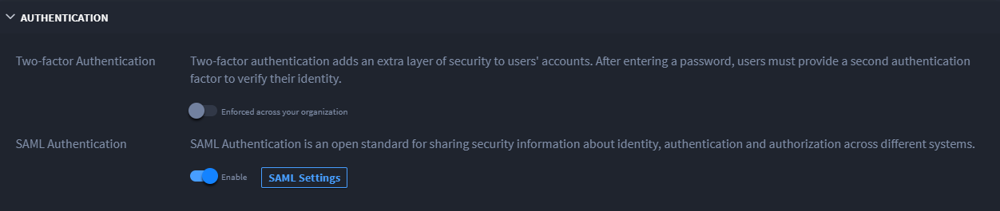

Enable SAML for SSO
===================

SAML is an open standard for web browser single sign-on. Using SAML, a
service provider (Swimlane) asks an identity provider (a third party) to
authenticate and provide information about a user.

This is initiated in two different ways. In one, Swimlane initiates
login. In the other, the identity provider initiates the login. Set up
SAML in Swimlane Settings, Sessions & Security.

Swimlane Service Provider SAML Metadata
---------------------------------------

The following table contains the metadata you need to know when
configuring Swimlane with an identity provider.

+----------------------------------+----------------------------------+
| Metadata                         | Usage                            |
+==================================+==================================+
| Entity ID:                       | Configurable in Swimlane SAML    |
|                                  | settings                         |
+----------------------------------+----------------------------------+
| Assertion Consumer Service (ACS) | https://{swimlane                |
| url:                             | -hostname-here}/api/saml/consume |
+----------------------------------+----------------------------------+
| ACS binding:                     | ☑ HTTP-POST ☐ HTTP-REDIRECT      |
+----------------------------------+----------------------------------+
| Single Logout Service (SLS) url: | Single Logout is not currently   |
|                                  | supported by Swimlane            |
+----------------------------------+----------------------------------+
| SLS binding:                     | N/A                              |
+----------------------------------+----------------------------------+
| NameID format:                   | "emailAddress" if email address  |
|                                  | is selected as NameID format in  |
|                                  | Swimlane settings, otherwise     |
|                                  | "unspecified"                    |
+----------------------------------+----------------------------------+
| AuthN request binding:           | ☐ HTTP-POST ☑ HTTP-REDIRECT      |
+----------------------------------+----------------------------------+
| AuthN requests signed:           | Configurable in Swimlane SAML    |
|                                  | settings                         |
+----------------------------------+----------------------------------+
| AuthN requests encrypted:        | No                               |
+----------------------------------+----------------------------------+
| Signing certificate:             | Configurable in Swimlane SAML    |
|                                  | Settings                         |
+----------------------------------+----------------------------------+
| Assertions encrypted:            | Encrypted assertions are not     |
|                                  | currently supported by Swimlane  |
+----------------------------------+----------------------------------+

**Important!** A successful log in with SAML requires a user that
matches the NameID username or email address that already exists in
Swimlane. Swimlane does not support Just-in-Time (JIT) provisioning.
SAML is available to users added by Directory Services sync as well as
those added manually.

To enable SAML for SSO:

#. From the Sessions and Security dashboard, click **>** to expand
   **Authentication.**

#. Under SAML Authentication, toggle the switch to enable SAML
   Authentication.
   |image1|

3. Next, click **SAML Settings.**

4. On SAML Authentication, identify the **Name ID Format.** Select from
   the dropdown. You have two options for users logging in to Swimlane,
   the Swimlane username, or email address.

5. Next, complete the following required fields:

   -  **SSO URL**
   -  **Identity Provider Entity ID**
   -  **Service Provider Entity ID**

6. Specify whether to verify the identity provider signature or whether
   to allow invalid signatures with the **Verify Identity Provider
   Signature** toggle and then upload the certificate.

7. Select whether the SAML request should be signed by Swimlane with the
   **Sign AuthnRequest?** toggle and then upload the private key (format
   PKCS #12) and public certificate.

8. If your SSO provider calculates the SAML response signature with
   non-significant whitespace, select the **Preserve whitespace in SAML
   response?** toggle.

