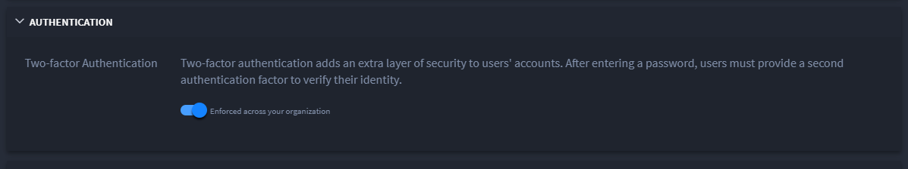
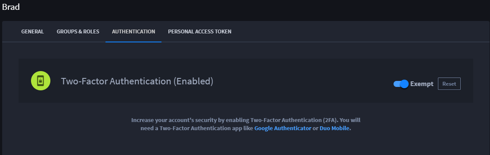

Enable Two-Factor Authentication
================================

Two-Factor Authentication, or 2FA, adds an additional layer of security
to Swimlane user accounts. Each time users sign in, they will need a
password and a verification code.

You can enforce 2FA across your organization. Users will then be
required to set up 2FA and will not be able to disable the setting.

If you choose not to enforce 2FA globally, then individual users will be
able to enable setting up 2FA.

Globally Enabling Two-Factor Authentication
-------------------------------------------

To globally enable two-factor authentication:

#. From the Sessions and Security dashboard, click **>** to expand
   **Authentication.**

#. Toggle **Enforced across your organization** to turn on 2FA for
   everyone accessing Swimlane from your organization.
   |image1|

Enabling Two-Factor Authentication as an Individual User
--------------------------------------------------------

Users can enable two-factor authentication for themselves.
Administrators cannot individually assign 2FA to a subset of users.

Instruct users to set up their individual 2FA credentials using the
following steps.

**Note:** Users who encounter the log in screen of a globally enabled
2FA organization will access the *Enable Two-Factor Authentication*
window upon attempting to log in to Swimlane. Users who want to enable
2FA individually will need to follow steps 1 - 3, below.

To enable two-factor authentication as an individual user:

#. If you have administrator access, from the global navigation menu,
   hover over the **Users, Groups, and Roles** icon, then select
   **Users**.

#. From the Users page, locate your user account and open it.

Alternatively, you can access your Profile Options from the upper right
corner of the Swimlane UI.

3. On User Profile, click the Authentication tab, then click **Enable
   2FA.**

Additional Administrator Actions for 2FA
----------------------------------------

Administrators can reset the 2FA setup for users as needed. To reset a
user's individually-set 2FA account, log in and access the User page.
Open the user's profile page, and select the Authentication tab. Click
**Reset.**

The user will be prompted to set up a new instance of 2FA for Swimlane
once they attempt to log in again.

Administrators can also exempt specific users from having to use 2FA. To
do this, access the specific user, and then toggle the **Exempt** switch
on the User Profile Authentication window.

|image2|

