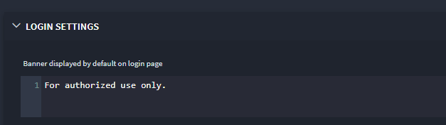
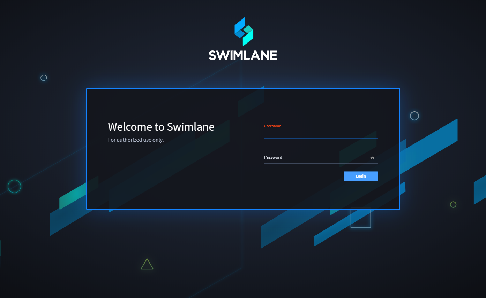
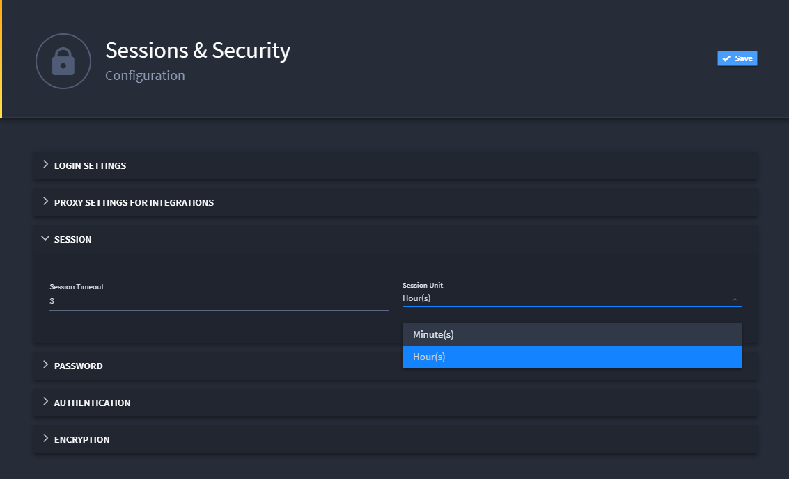
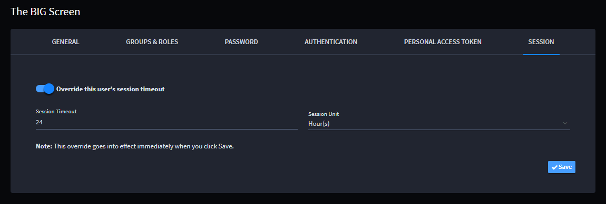
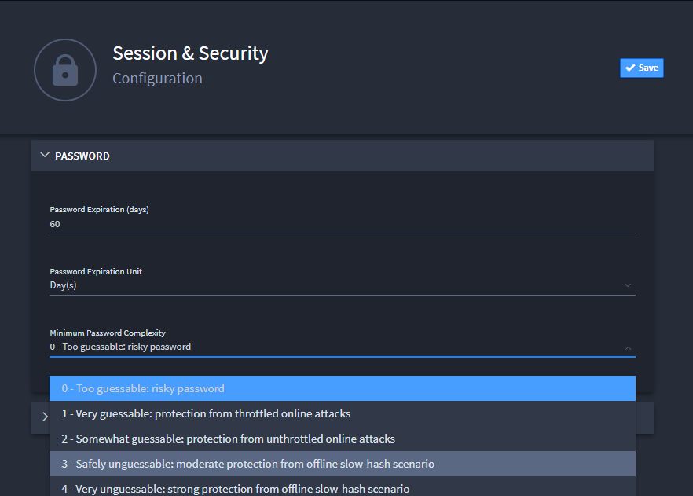
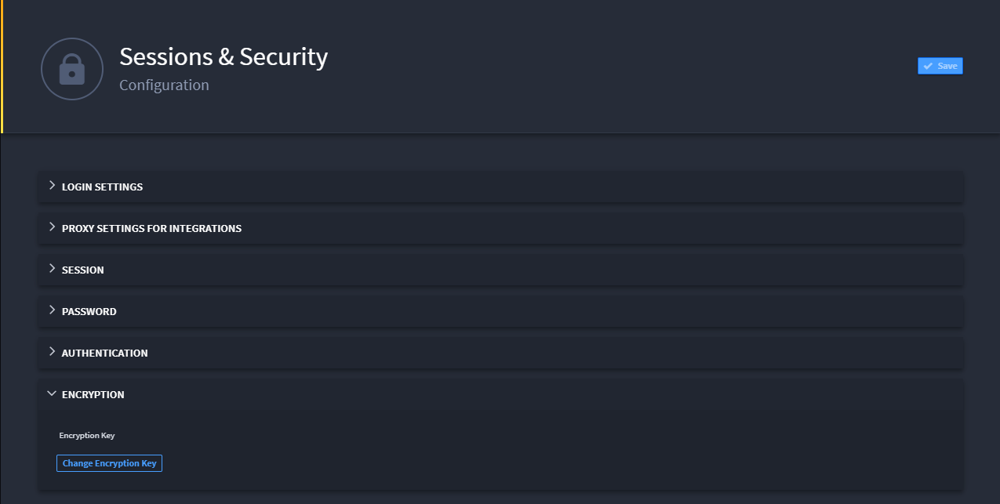

Sessions and Security
=====================

Go to Sessions and Security to configure your user sessions, passwords,
and encryption details. This is also where you specify the length of
active user sessions.

**Note:** For detail on setting up the Authentication section of
Sessions and Security see `Enable SAML for
SSO <enable-saml-for-sso.htm>`__ and `Enable Two-Factor
Authentication <enable-two-factor-authentication.htm>`__.

Setting Up Login Settings
-------------------------

As an administrator, you can include banner text on the login page for
legal notices or announcements for your Swimlane users.

To set up login settings:

#. From the Sessions and Security dashboard, click **>** to expand
   **Login Settings.**

   |image1|

#. Enter text as needed in the editor and click **Save.**

   The text you enter here is displayed as a banner on the Swimlane
   login page.

   |image2|

Setting Up Proxy Settings for Integrations
------------------------------------------

Swimlane supports global proxy settings for all of your integrations.
Using the proxy settings makes managing your integrations easier and
more manageable.

**Note:** Swimlane supports the ``HTTP_PROXY`` and/or ``HTTPS_PROXY``
environment variables.

To set up proxy settings for integrations:

#. From the Sessions and Security dashboard, click **>** to expand
   **Proxy Settings for Integrations.
   **

2. Enter the **HTTP Proxy** address and the **HTTPS Proxy** address.
   Swimlane will assign the proxy for all integrations under your
   settings as administrator.

Setting Up Session Timeout Parameters
-------------------------------------

As an administrator, you control the amount of time a Swimlane session
can be active before the user is forced to re-authenticate, or log out
and log back in.

To set up session timeout parameters:

#. From the Sessions and Security dashboard, click **>** to expand the
   **Session** controls.

#. Specify the length and the unit of time to be used to measure the
   user session and click **Save.**

   Use the drop-down to specify the **Session Unit,** Hour(s) or
   Minute(s).

   |image3|

   **Note:** When you adjust the timeout session parameters here, be
   aware that users will need to log out and back in in order to for the
   updated time frame to apply. All user sessions will have the
   previously-set timeout value until their current sessions expire or
   they log out and log back in.

Overriding a User's Session Timeout
~~~~~~~~~~~~~~~~~~~~~~~~~~~~~~~~~~~

Administrators can override a specific user's session timeout. This is
helpful, for example, when you use one Swimlane session as a dashboard
for a work area. The dashboard is useful and visible to many people on
the team, and you don't want that dashboard to session to timeout
frequently. It can also be helpful when you need to immediately disable
a user's session. In cases similar to these, you can override the user's
session timeout.

To override a user's session timeout:

#. From the global navigation menu, select Users, Groups & Roles, and
   then select Users.

#. On Users, select the user whose session timeout you want to override.

#. | On the user's profile settings, click the **Session** tab.
   | |image4|

4. Toggle the **Override this user's session timeout** switch, and then
   specify the time-frame for the override (minutes, or hours).

The minimum you can specify for this override is 1 minute. The maximum
is 5 years (43800 hours or 2628000 minutes).

5. Click **Save**.

The override goes into immediate effect once you click save.

Setting Up Security Parameters
------------------------------

As an administrator, you have control over password reset intervals and
the allowable level of complexity required for user passwords, including
enabling Two-Factor Authorization for accessing Swimlane. You also need
to specify an administrator email that will be used to notify the
Swimlane administrator for your organization.

To set up security parameters:

#. From the Sessions and Security dashboard, click **>** to expand the
   **Password** controls.

#. Specify a password expiration length.

   Users will need to create a new password when they meet this
   expiration date.

   **Note:** This setting does not apply to users synced from Active
   Directory.

#. Use the drop-down to select the appropriate value for **Minimum
   Password Complexity.** Available values are:

   -  0 - Too guessable: risky password
   -  1 - Very guessable: protection from throttled online attacks
   -  2 - Somewhat guessable: protection from unthrottled online attacks
   -  3 - Safely unguessable: moderate protection from offline slow-hash
      scenario
   -  4 - Very unguessable: strong protection from offline slow-hash
      scenario

   |image5|

#. Specify the **Security Notification Email** for your organization.
   This email receives notifications when user profiles are locked.

Setting Up Encryption Keys
--------------------------

To set up encryption keys:

#. From the Sessions and Security dashboard, click **>** to expand the
   Encryption controls.

#. Click **Change Encryption Key** to modify the original encryption
   key.

   |image6|

   In a distributed server environment, add an encryption key to a
   tasks-only server by entering the following at the command line:

   dotnet tasks.dll key KEY_VALUE

   **Important!** When you change the encryption key, you invalidate all
   of the saved keys in the Key Store.

.. toctree::
   :titlesonly:
   :caption: Children:

   /Content/administrator-guide/settings/sessions-and-security/enable-saml-for-sso
   /Content/administrator-guide/settings/sessions-and-security/enable-two-factor-authentication
