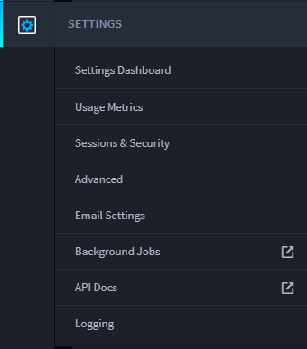
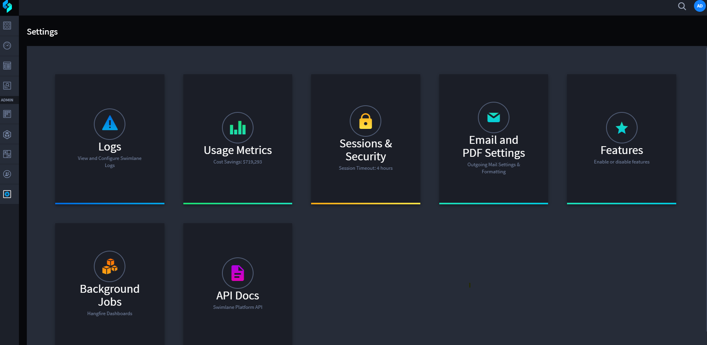

Swimlane Settings
=================

Swimlane Settings control global Swimlane settings and contain error and
troubleshooting tools.

Click the Settings icon in the navigation menu to access the settings
dashboard. You can also hover over the icon and select from the
available options.

|image1|

Swimlane Settings are only available to administrators.

|image2|

In Settings, administrators can:

-  Back up Swimlane.
-  Set the Swimlane URL.
-  View usage metrics.
-  Track time and cost savings.
-  Update the Swimlane license.
-  Sync Swimlane with Active Directory or Open LDAP.
-  Set a login banner.
-  Define security parameters.
-  Specify the Swimlane administrator email.
-  Set up an outgoing email server.
-  Format outgoing email messages.
-  View Swimlane logs, API documentation, and the background jobs
   dashboard.

.. toctree::
   :titlesonly:
   :caption: Children:

   /Content/administrator-guide/settings/usage-metrics
   /Content/administrator-guide/settings/sessions-and-security/sessions-and-security
   /Content/administrator-guide/settings/advanced/advanced
   /Content/administrator-guide/settings/email-and-pdf-settings
   /Content/administrator-guide/settings/background-jobs
   /Content/administrator-guide/settings/api-docs
   /Content/administrator-guide/settings/backups
   /Content/administrator-guide/settings/logging
