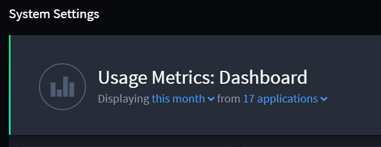
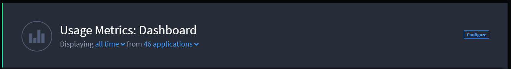
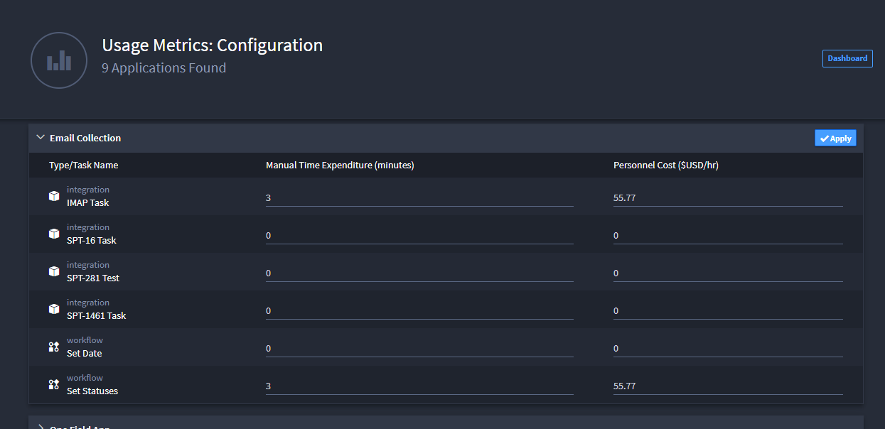

Usage Metrics
=============

The Usage Metrics dashboard allows you to view time and cost savings
that relate to the usage of your tasks. The graphics in the dashboard
are a powerful visual indicator of your return on investment.

You control the view on the Usage Metrics dashboard. Adjust the time
frame and the applications you want to display in the Usage Metrics:
Dashboard header.

|image1|

Scroll down to see the usage metrics for your organization, including:

-  Automations performed.
-  Records created.
-  Hours saved.
-  Cost savings.
-  Executions over time.
-  Total time saved.
-  Task usage.

Default Usage Metrics Values
----------------------------

If you don't customize usage metrics, Swimlane will apply default
values. The time default is three (3) minutes, and the cost default is
$74.23. Swimlane determined the time value based on a general time
estimate for processing a task. The cost default is based on the median
salary for Information Security Analysts according to `US News & World
Report <https://money.usnews.com/careers/best-jobs/information-security-analyst/salary#:%7E:text=Other%20Best%20Jobs,Computer%20Systems%20Administrators%20made%20%2487%2C070>`__.
The United States Department of Labor, Bureau of Labor Statistics, list
that median salary in the 50th percentile of employer costs for employee
compensation, which then calculates to $74.23.

``($98,350 * 1.419 (fringe))/1880 (average hours worked a year) = $74.23/hour``

Adjusting the Usage Metrics Configuration
-----------------------------------------

To adjust the Usage Metrics configuration:

#. On Usage Metrics: Dashboard, click **Configure.**

   |image2|

#. On Usage Metrics: Configuration, view the list of applications, then
   click **>** to expand your view of an application.

   |image3|

   From here you can view the time expenditures and cost amounts for the
   application, listed by the integration tasks created for the
   application. Additionally, you can see whether the integration task
   is part of an application layout or workflow.

   **Note:** The time default is three (3) minutes, and the cost default
   is $74.23. For more information, see `Default Usage Metrics
   Values <#Default>`__.

#. Adjust the time in **Manual Time Expenditures** (by minutes), and the
   cost in **Personnel Cost** (by $/hr) to what is applicable for your
   organization. Click **Apply** and close the expanded view of the
   application.

4. Click **Dashboard** to return to the dashboard-view of Usage Metrics.

Usage Metrics Formulas
----------------------

This table displays the formulas that Swimlane uses behind the scenes to
calculate your usage metrics.

+------------------------+---+-------------------------------+
| **Usage Metric**       |   | **Formula**                   |
+========================+===+===============================+
| TotalCostSavings       | = | ManualTimeCost • (            |
|                        |   | TotalTimeSavings/3600.0 )     |
+------------------------+---+-------------------------------+
|                        |   |                               |
+------------------------+---+-------------------------------+
| TotalTimeSavings       | = | ( ManualExecutionTime • 60 •  |
|                        |   | TotalExecutions ) -           |
|                        |   | TotalExecutionDuration        |
+------------------------+---+-------------------------------+
|                        |   |                               |
+------------------------+---+-------------------------------+
| TotalExecutions        | = | Σ ( UsageEntry.ExecutionCount |
|                        |   | )                             |
+------------------------+---+-------------------------------+
|                        |   |                               |
+------------------------+---+-------------------------------+
| TotalExecutionDuration | = | Σ (                           |
|                        |   | U                             |
|                        |   | sageEntry.TotalExecutionCount |
|                        |   | )                             |
+------------------------+---+-------------------------------+
|                        |   |                               |
+------------------------+---+-------------------------------+
| AverageCostSavings     | = | ManualTimeCost • (            |
|                        |   | AverageTimeSavings/3600.0 )   |
+------------------------+---+-------------------------------+
|                        |   |                               |
+------------------------+---+-------------------------------+
| AverageTimeSavings     | = | ( ManualExecutionTime • 60 )  |
|                        |   | - AverageExecutionTime        |
+------------------------+---+-------------------------------+
|                        |   |                               |
+------------------------+---+-------------------------------+
| AverageExecutionTime   | = | TotalExec                     |
|                        |   | utionDuration/TotalExecutions |
+------------------------+---+-------------------------------+
|                        |   |                               |
+------------------------+---+-------------------------------+
| ManualExecutionTime    | = | Us                            |
|                        |   | ageTask.ManualTimeExpenditure |
+------------------------+---+-------------------------------+

