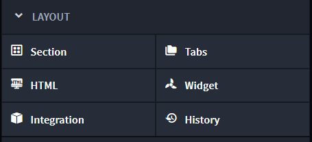
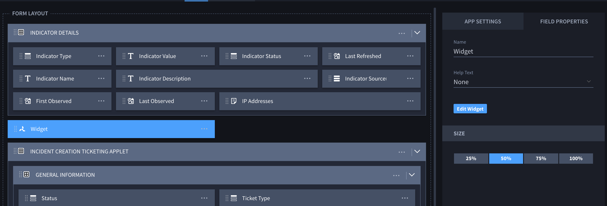

Record Widgets
==============

To create record Widgets, from the Layout section of the Application
Builder or Applet Builder page, select **Widget** and then drag and drop
it into the Form Layout.

|image1|

You can add multiple widgets per application or applet.

To edit the record widget, select the widget in the layout. Then, in the
properties sidebar, click "Edit Widget."

|image2|

Record widgets are rendered on the record page and have access to the
record values through the record attribute. Every change to the record
will automatically update the widget, by calling its ``update`` method.

The record attribute is a javascript object, where the keys are the
field's key property, and the value is the field value for that record.

Example: If an application has a text field with the key ``text`` and a
numeric field with the key ``numeric``, the record object would look
like this:

{ text: 'text field value', numeric: 55 }

This object can be used in the widget's ``update`` method to generate
the updated HTML of the widget after a change.

Widgets do not store any data; they are only used to build a UI that
interacts with other data on the record. If any data needs to be stored,
do so in a field on the record (either visible or hidden).

Exporting an application or applet will also export the widget as part
of it, so it can be easily imported to another instance of Swimlane.
This allows the record widgets to be shared and reused very easily by
embedding them into an applet and exporting it. Since the widget's code
is also included in the exported application or applet JSON file,
Swimlane recommends that you **do not** include any sensitive
information in widgets.

