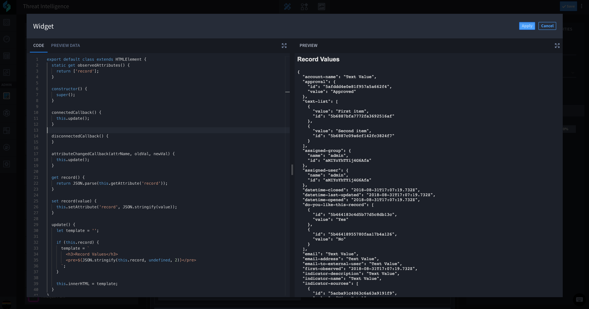
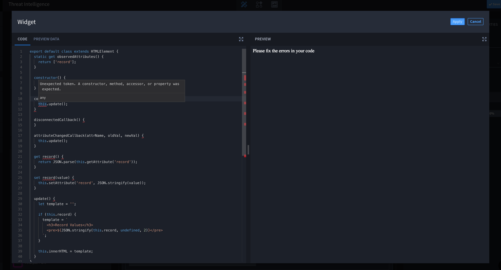
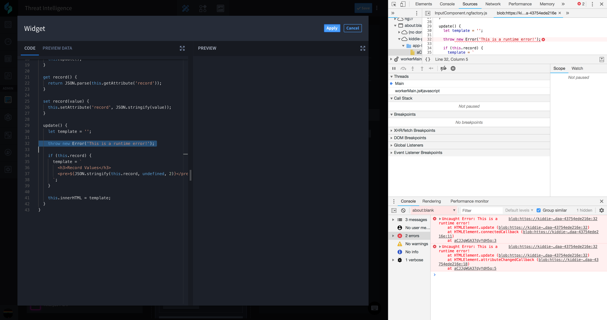

Widgets Editor
==============

You define widgets with Swimlane's built-in widget editor. The editor
consists of two main parts: a code editor and a preview panel.

|image1|

The code editor is where you define and modify your widget. The Code tab
contains the code of the widget, while the Preview Record Data tab
contains the data that can be used to test and debug the widget while
your are in the editor. This data is generated to match the format of
data that would be passed to the widget once it is rendered on the
record/dashboard page. The Preview Context Data tab holds the current
detail in context to the widget, such as which application it resides
within, the fields and values it relies on, etc.

The preview panel renders the widget in real time and updates as changes
are made to the widget code or the preview data. Every change you make
will trigger the preview to update.

The editor has a base widget template which renders the data the widget
receives in a ``<pre>`` tag. This template sets up the custom element to
listen to any changes in the data and update itself.

Any syntax errors in the widget's code are highlighted in the editor
itself, and the preview is disabled until those errors are fixed.

|image2|

Any run-time errors will display in the browser console where you can
inspect them using the browser's developer tools.

**Tip:** Swimlane recommends having your browser's developer tools open
while building widgets.

|image3|

