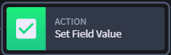
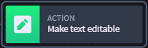
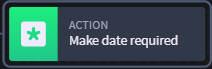
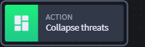
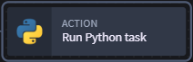
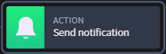
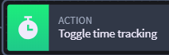

Actions
=======

If workflow is a tree, and conditions are branches, then actions are the
leaves of the tree. Actions are the specific tasks that occur. They
cannot have child nodes, and are controlled by the defined conditions
and actions in the workflow. Each action type has specific options. See
the table below for an introduction to each option:

**Swimlane Workflow Action Options**

+---------------------------+-----------+---------------------------+
| **Workflow Action**       | **Icon**  | **Definition**            |
+===========================+===========+===========================+
| **Set Field Value**       | |image19| | Updates the value of a    |
|                           |           | field to a specified      |
|                           |           | value.                    |
+---------------------------+-----------+---------------------------+
| **Set Field Read/Write**  | |image20| | Sets a field to read-only |
|                           |           | or editable status.       |
+---------------------------+-----------+---------------------------+
| **Set Field               | |image21| | Makes a specified field   |
| Required/Optional**       |           | required or optional.     |
+---------------------------+-----------+---------------------------+
| **Filter Value Lists**    | |image22| | Updates the list of       |
|                           |           | available values for a    |
|                           |           | specific field.           |
+---------------------------+-----------+---------------------------+
| **Modify Layout**         | |image23| | Shows or hides fields in  |
|                           |           | a record.                 |
+---------------------------+-----------+---------------------------+
| **Trigger Integration**   | |image24| | Initiates a task from an  |
|                           |           | integration.              |
+---------------------------+-----------+---------------------------+
| **Trigger Notification**  | |image25| | Initiates a notification  |
|                           |           | to specified recipients.  |
+---------------------------+-----------+---------------------------+
| **Export and Email        | |image26| | Sends record in email to  |
| Record**                  |           | specified recipients.     |
+---------------------------+-----------+---------------------------+
| **Toggle Time Tracking    | |image27| | When selected, tracks the |
| for Record**              |           | time for the record       |
+---------------------------+-----------+---------------------------+

For more detail on each of these action types, see `Create and Update
Workflow <../create-and-update-workflow.htm>`__.

**Note:** Some fields are not available to be defined in actions,
including variable fields like comments, html fields, and other
non-configurable data types.

.. |image4| image:: ../../../Resources/Images/filtervalueslists.png

.. |image13| image:: ../../../Resources/Images/filtervalueslists.png

.. |image22| image:: ../../../Resources/Images/filtervalueslists.png

.. toctree::
   :titlesonly:
   :caption: Children:

   /Content/administrator-guide/workflow/actions/select-action-type
   /Content/administrator-guide/workflow/actions/send-notification-messages
