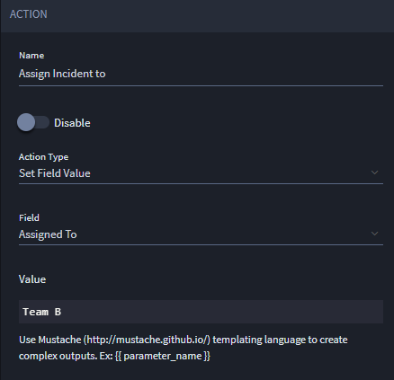
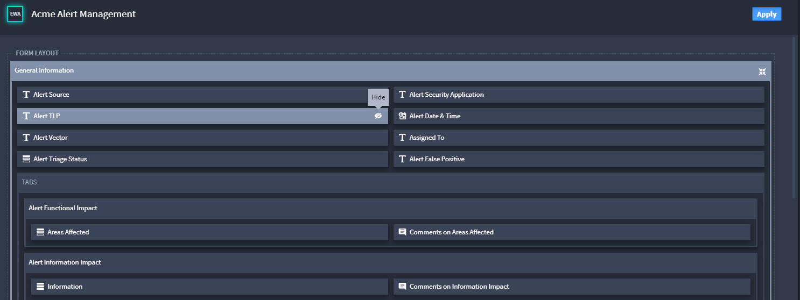
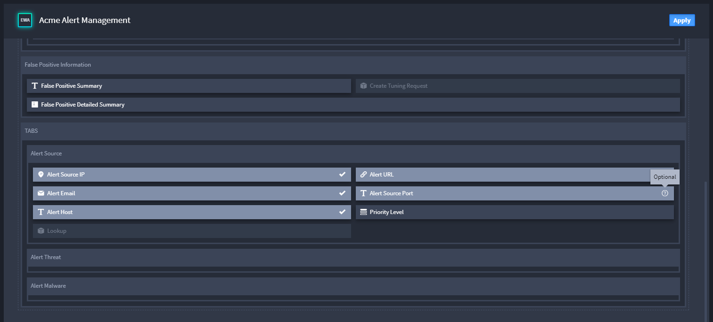
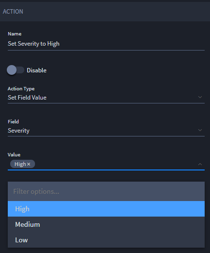
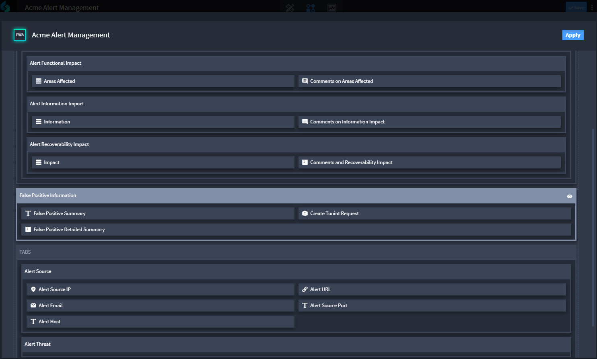
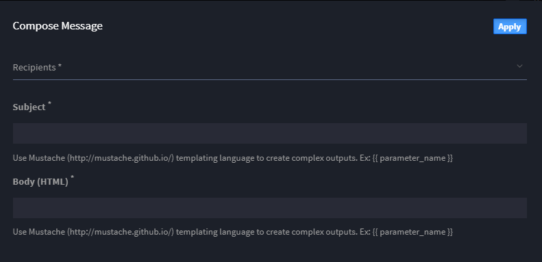
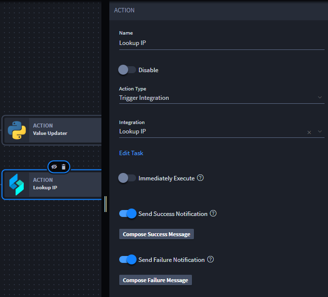
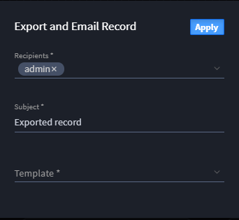

Select Action Type
==================

Review this topic to learn more about the different workflow action
types.

Set Field Value
---------------

This action updates a field value.

|image1|

The value for the field you select changes according to the inputs
available for the field. For example, if you select a date or time
field, then your values will be relative to dates and times. If you
decide to use a selection field, you will see the defined incident types
as multiple values as in the example above.

You also have the ability to set up Usage Metrics for this action. Usage
Metrics track the time and cost you are saving by automating this task.
To set Usage Metrics, under Integration ROI Calculation Metrics fill out
the **Manual Time Expenditure** and **Personnel Costs** fields so that
the value of the automation is calculated in Usage Metrics.

Set Field Read or Write
-----------------------

Use this action to set a field as read-only or as an editable field.

|image2|

Click **Select Fields** to open a window with a view of the fields in
the application. Click a field to set it to Hide, or read-only status.
Click it again to set it to an editable status. You can see the existing
status of the field by hovering over the field. A lock icon indicates
read-only status; a pencil icon indicates an editable status.

Set Field Required or Optional
------------------------------

Use this action to specify whether a field is required or optional.

|image3|

Click **Select Fields** to open a window with a view of the fields in
the application. Click a field to set it to required status. Click it
again to set it to an optional status. You can see the existing status
of the field by hovering over the field, or by the checkmark or question
mark icon on the field upon update.

Filter Selection Options
------------------------

Use this action to specify the values to update on a field that has
multiple values available.

|image4|

Modify Layout
-------------

Use this action to specify whether a field displays in the record.

|image5|

Click **Select Layout Items** to open a window that displays the fields
available in the application. Click a field to have a field exposed to
view, or hidden from view. You can use this action on sections, tabs,
and html elements. For sections and tabs you can view, hide, expand, and
collapse.

Trigger Notification
--------------------

Use this action to send an email message to a list of recipients.

|image6|

Click **Compose Message** to open a window where you can specify who the
email should be sent to. You can also edit the subject and body of the
email message here.

You also have the ability to set up Usage Metrics for this action. Usage
Metrics track the time and cost you are saving by automating this task.
To set Usage Metrics, under Integration ROI Calculation Metrics fill out
the **Manual Time Expenditure** and **Personnel Costs** fields so that
the value of the automation is calculated in Usage Metrics.

Trigger Integration
-------------------

Use this action to trigger an integration task.

|image7|

Click **Edit Task** to open the task identified in the **Integration**
field. You can also create a new task from the pull-down menu of the
**Integration** field.

If you'd like to be notified when the integration runs, select **Send
Success Notification** or **Send Failure Notification**, and then
compose the notification message.

For more information on sending notifications, see `Send Notification
Messages. <send-notification-messages.htm>`__

Enable **Immediately Execute** to specify that the integration task runs
as soon as the conditions are met, or only when the record is saved.
Turn off this option if you want to only run the integration task upon
saving a record.

When you enable the Immediately Execute option, workflow runs:

-  As soon as the condition is met when editing a record.
-  As soon as the condition is met viewing a record.
-  When the record is saved.

**Note:** Enabling the Immediately Execute option will increase the
frequency of the "Keep Local Changes?" dialog, which attempts to
reconcile changes made by the user and the server running the triggered
integration. Therefore, Swimlane recommends that you avoid enabling this
option whenever possible.

You also have the ability to set up Usage Metrics for this action. Usage
Metrics track the time and cost you are saving by automating this task.
To set Usage Metrics, under Integration ROI Calculation Metrics fill out
the **Manual Time Expenditure** and **Personnel Costs** fields so that
the value of the automation is calculated in Usage Metrics.

Export and Email Record
-----------------------

Use this action to export the record in a format defined by an export
template, and then send the exported record in a file to a list of
recipients.

|image8|

Click **Configure Export** to open a window where you can specify the
recipients of the email and the email subject. Click **Template** to
select the export template, and then click **Save.**

**Note:** You create templates in Application Builder. Click the
three-dot icon in the Application Builder toolbar (in the upper-right
corner) and select Export Templates. See `Create or Edit Export
Templates <../../export-templates/create-or-edit-export-templates.htm>`__
for more information.

You also have the ability to set up Usage Metrics for this action. Usage
Metrics track the time and cost you are saving by automating this task.
To set Usage Metrics, under Integration ROI Calculation Metrics fill out
the **Manual Time Expenditure** and **Personnel Costs** fields so that
the value of the automation is calculated in Usage Metrics.

