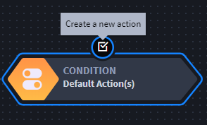
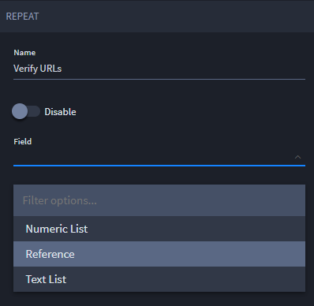

Create and Update Workflow
==========================

Before you begin creating workflow, you should have a clear idea of the
process you want to design. This includes understanding the many
conditions and actions you have available to you.

As you build your workflow, you'll create branches of conditions,
repeats, and actions.

======== =========================================
Icon     Definition
======== =========================================
|image1| Creates a new condition
|image2| Creates a new action
|image3| Creates a new repeat action
|image4| Disables the branch, condition, or action
|image5| Deletes the branch, condition, or action
======== =========================================

To create or update workflow:

#. Open an applet or application, then select the Workflow icon from the
   toolbar.

2. The application's workflow opens with a default start icon, which can
   be followed by multiple conditions, including the default condition,
   **Default Action.**

3. To add a new condition, select the Start icon (the root of the
   workflow) and then click the icon for *Create a new condition.*

4. On Condition, provide a name and then indicate the field(s) from the
   applet or application that are part of the process you are designing.

5. Click **Add additional condition** to add more than one condition to
   the flow.

6. Click **Save** to save the condition.

7. Select the condition you just created and then click the icon to
   *Create a new action.*

   |image6|

8. On Action, name the action, then select the action type.

9.  Click **Save**.

10. If your action is a Trigger Integration, Trigger Notification,
    Export and Email Record, or Set Field Value type, then you also have
    the ability to set up Usage Metrics for the action. Under
    Integration ROI Calculation Metrics fill out the **Manual Time
    Expenditure** and **Personnel Costs** fields so that the value of
    the automation is calculated in Usage Metrics.

11. Click **Apply Metrics**, and then click **Save**.

Setting Up Repeat Actions
-------------------------

Repeat actions are an optional part of workflow setup, and they work
exclusively with Text List and Numeric List fields. Use a repeat action
when you want a specific integration task action to run over a list of
values within a Text List field or a Numeric List field. The Repeat runs
the integration task action once for each item in the List field that
meets the criteria that you specify when setting up workflow.

Repeats must be preceded by a Condition and must be followed by an
action of a Trigger Integration action type.

To set up repeat action:

#. Add or select a condition in your application's workflow.
#. In the workflow properties, assign the condition a name and a
   condition.
#. Select the condition you just created and then click the click the
   icon to *Create a new repeat.*

4. Next, designate the field you want the integration action to iterate
   over.

   **Note:** Repeats only reference Text List, Numeric List fields and
   multiple-select or grid reference fields.

   |image7|

5. Select the repeat you just created and then click the icon to *Create
   a new action.*

6. If you'd like to be notified when the integration runs, select **Send
   Success Notification** or **Send Failure Notification,** and then
   compose the notification message.

