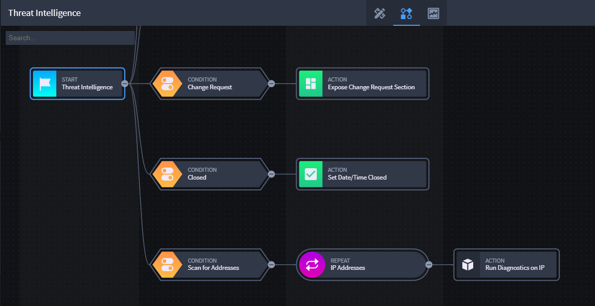
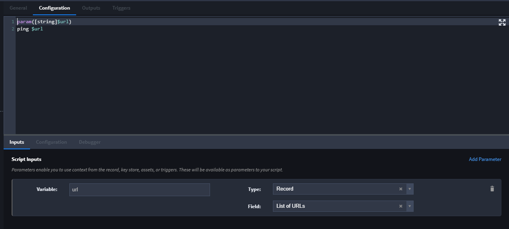
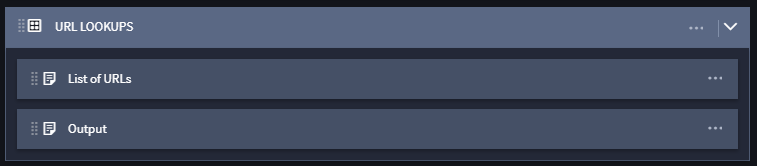
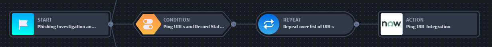
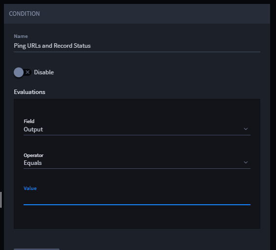
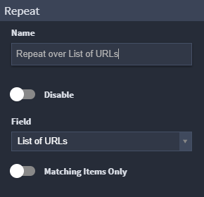
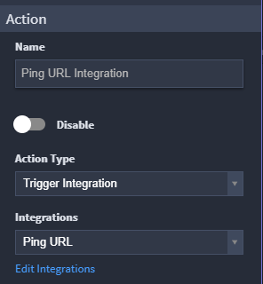
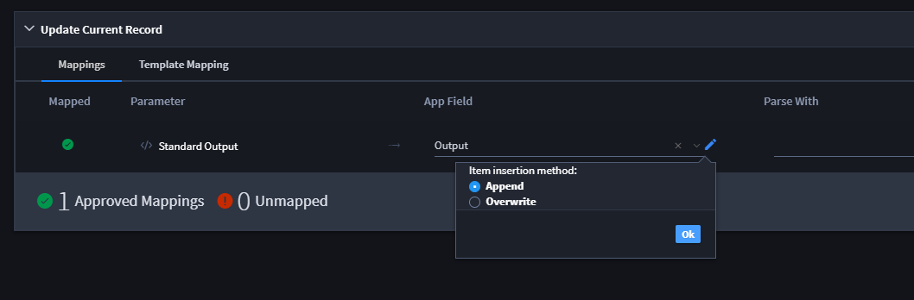

Repeats
=======

Repeats iterate over a Text List, Numeric List, Grid, or Multi-select
Reference field and perform an action for each value in the list or
array of data. You can adjust the Repeat to filter the values within the
list field.

**Note:** Repeat workflow *only* works with Text List, Numeric List, and
Grid or Multi-select Reference fields.

|image1|

Including a Repeat workflow requires that you've also set up an
integration task that uses the list or reference field as an input
value. The input value is the action that is run against the record
using each value in the List field.

For more information about setting up integration tasks, see `Create or
Edit a Task <../integrations/create-or-edit-a-task.htm>`__.

A branch of workflow that includes repeat will first begin with a
condition, then a repeat, and then an action which must trigger an
integration.

Take the following scenario as an example of how you can utilize repeat
workflow functionality:

-  Your application has a Text List field set up that contains multiple
   URLs as values.
-  When saving a new record, you want to be able to ping each of the
   URLs and receive information back about them.
-  You want the record to store the information that comes back about
   each of the URLs.

Here is one way you can realize this scenario:

#. Create a Powershell integration task. From the Configuration tab,
   include the script and input parameter variable seen here:

   |image2|

   In this application, the List of URLs field is a Text List field.

#. Access your application and ensure that you have the Text List field
   set up and that it contains, or is set up to receive, the list of
   values you need (for this scenario, the values are URLs).

   You can manually enter the values, or setup a task and output mapping
   to produce the values in the Text List field.

#. Create another Text list field, Output, to serve as a container for
   the information you receive back from pinging the URLs.

   |image3|

#. Access workflow within Application Builder and create a new
   Condition, Repeat, and Trigger Integration Action.

   |image4|

#. Configure the workflow properties for each stage.

   Condition properties for this scenario:

   |image5|

   Repeat properties for this scenario:

   |image6|

   Action (Integration Task) properties for this scenario:

   |image7|

#. Make sure that you have set up the integration task output mappings
   to handle the data coming in and out of the task (output mapping to
   the Output field). See `Configure Task
   Input <../integrations/configure-task-input.htm>`__ and `Configure
   Task
   Output <../integrations/configure-task-output/configure-task-output.htm>`__
   for more information.

   Output mapping for this scenario:

   |image8|

   **Note:** Select **Append** as an insertion method if you want to
   retain the list in the Output field and append to it with new data as
   the repeat actions are run.

