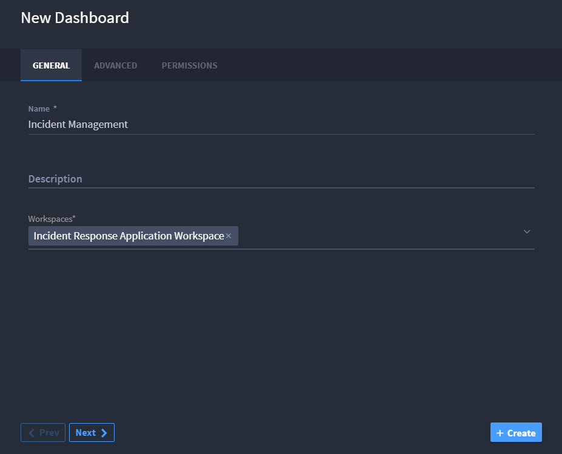
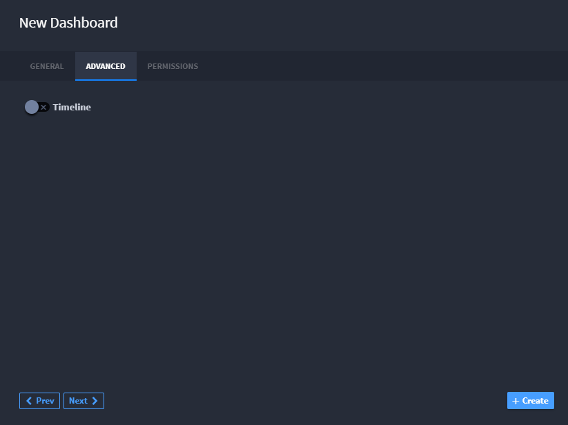
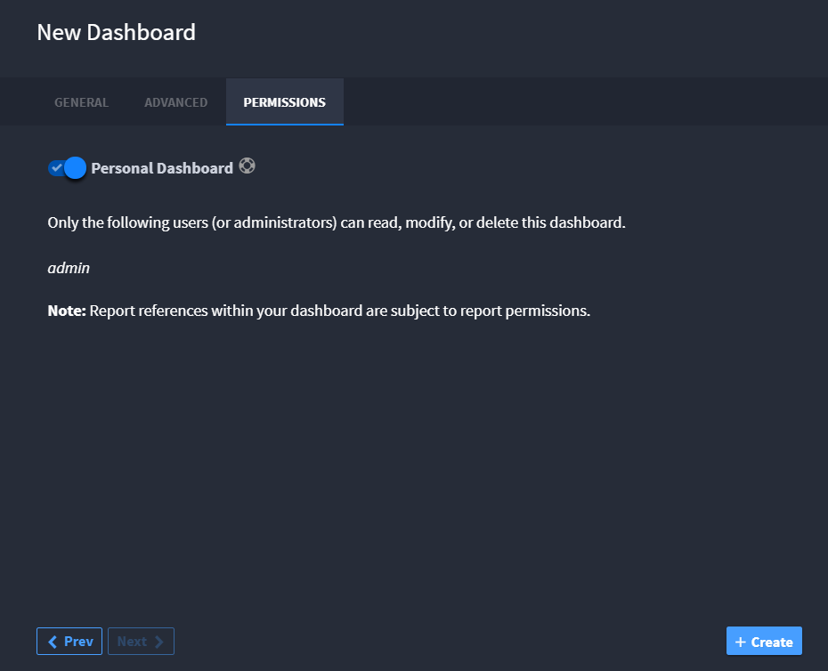
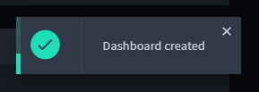

Create or Edit Dashboards
=========================

A Swimlane dashboard is a visual display of records, reports, and charts
associated with the applications in the workspace. A workspace can have
multiple dashboards.

Creating a Dashboard
--------------------

You can create a new dashboard from **Dashboards** under **Workspace
Management** or from any dashboard. For details on how to create a new
dashboard from a current dashboard, go to `Create or Edit User
Dashboards <../../user-guide/workspaces-and-dashboards/create-or-edit-user-dashboards.htm>`__.

To create a new dashboard:

#. | Under Workspace Management, from the Dashboards taskbar, select **+
     New Dashboard**.
   | |image1|

2. | On New Dashboard, enter the name, description, and associated
     workspaces.
   | |image2|

3. | Click the **Advanced** tab. To indicate whether you want the
     dashboard to record a timeline, enable or disable the timeline
     switch.
   | |image3|

4. | Click the **Permissions** tab. Specify whether the dashboard is a
     personal dashboard or specify other role-based permissions.
   | |image4|

5. | Click **+ Create** to create your dashboard. A dialog box will
     appear to show you that your dashboard has been successfully
     created.
   | |image5|

Editing a Dashboard
-------------------

You can edit a dashboard from **Dashboards** under **Workspace
Management** or from the dashboard you want to edit. For details on how
to edit your current dashboard, go to `Create or Edit User
Dashboards <../../user-guide/workspaces-and-dashboards/create-or-edit-user-dashboards.htm>`__.

To edit a dashboard:

#. From the navigation menu, select Workspace Management and then select
   the Dashboards page.

#. On the Dashboards page, click the pencil icon.

Deleting a Dashboard
--------------------

You can delete a dashboard from **Dashboards** under **Workspace
Management** or from the dashboard you want to delete. For details on
how to delete your current dashboard, go to `Create or Edit User
Dashboards <../../user-guide/workspaces-and-dashboards/create-or-edit-user-dashboards.htm>`__.

#. To delete a dashboard, under Workspace Management, on the Dashboards
   page, click the trash can icon.

2. Click **Ok** to delete the dashboard.

