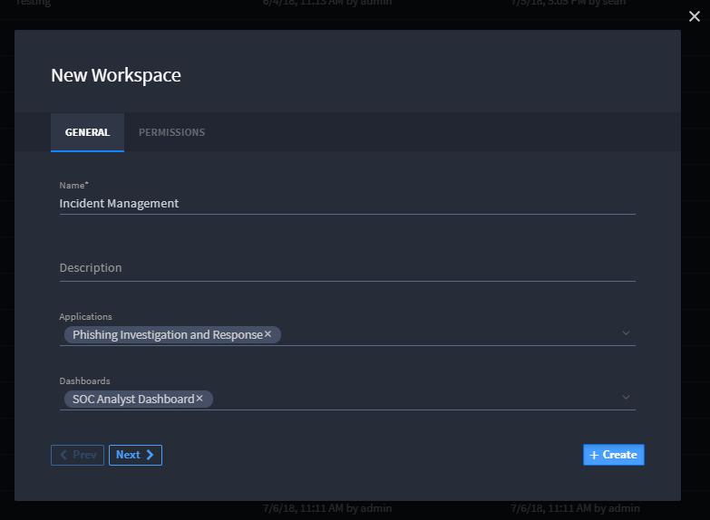
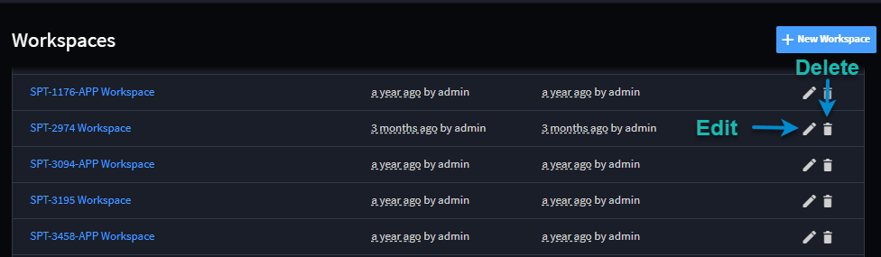

Create or Edit Workspaces
=========================

You can create, edit, and delete workspaces from the Workspaces list
page.

To create a new workspace, click **+New Workspace**. Define the general
information about the workspace and set permissions as needed.

|image1|

When you create a new workspace, you can specify the following:

-  Display Name
-  Description (Optional)
-  Linked Applications and Dashboards
-  Manage Permissions

To edit existing workspaces, click the pencil icon and to delete
existing workspaces, click the trash can icon.

|image2|

