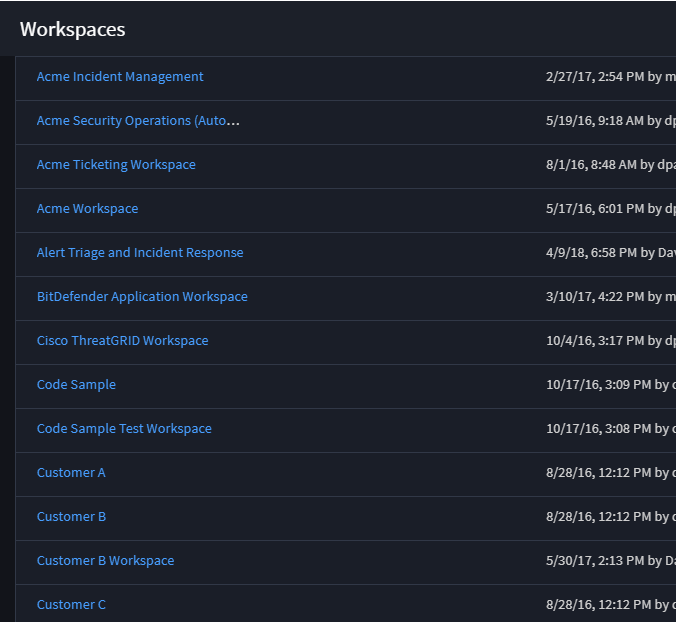

Workspace and Dashboard Management
==================================

As an administrator of a workspace, you have access to the Workspaces
page.

|image1|

From the Workspaces page, you can:

-  Create New Workspaces
-  Edit Existing Workspaces
-  Delete Workspaces
-  Access Dashboards

.. toctree::
   :titlesonly:
   :caption: Children:

   /Content/administrator-guide/workspace-and-dashboard-management/create-or-edit-workspaces
   /Content/administrator-guide/workspace-and-dashboard-management/create-or-edit-dashboards
   /Content/administrator-guide/workspace-and-dashboard-management/set-dashboard-permissions
   /Content/administrator-guide/workspace-and-dashboard-management/edit-reports
