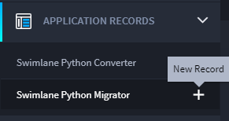
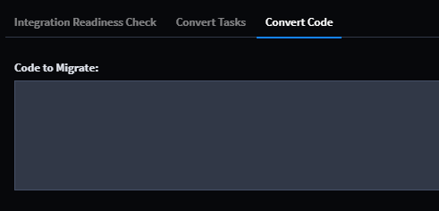
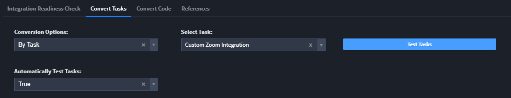
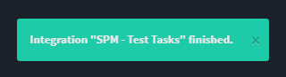
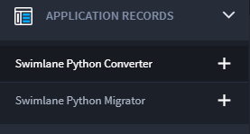
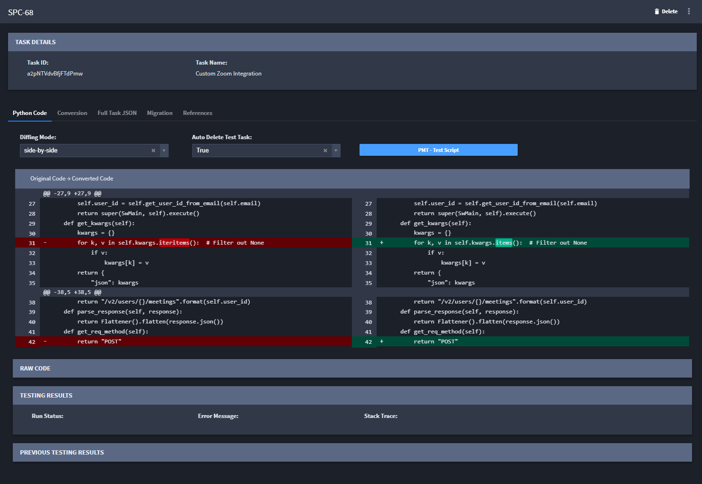

Migrate Python Tasks with the Python Migrator SSP
=================================================

Swimlane has engineered a Swimlane Solution Package (SSP) that
identifies applications and tasks that have Python 2.7 and steps you
through the process to migrate them to Python 3.6. A full migration tool
is planned to be delivered with the Swimlane 10.5.0 release. In the
meantime, this SSP can help you ensure that critical tasks that
currently run in Python 2.7 will be migrated to Python 3.6 and will
continue to work after upgrading to the 10.5.0 release.

Import the Python Migrator SSP
------------------------------

To import the Python Migrator SSP:

#. Click to download this SSP file

2. Log in to Swimlane as an administrator, and then from the
   Applications and Applets main page taskbar, click the plus menu icon
   and then select **Import applications and applets**.

For more information, see Import Swimlane Solution Packages in the
Swimlane Documentation.

The SSP includes two applications: Swimlane Python Migrator and Swimlane
Python Converter

Migrate Python Scripts
----------------------

Before you begin, ensure you have updated the following script inputs:

**Swimlane API PAT:**

-  SPM - Test Tasks

-  SPM - Integrations Readiness Check

-  SPC - Migrate Task to 3.6

-  SPC - Revert Task to 2.7

**Swimlane API PAT; Mongo Server, Port, User, Password:**

-  SPC - Integrator Tester

In addition, ensure that PyMongo Python3 is installed and Integration
Modifications are complete.

To migrate Python scripts:

#. From the Swimlane navigation menu, select Application Records, and
   then create a new record from the Swimlane Python Migrator
   application.

   |image1|

#. The record opens with a widget that explains the features of the SSP.
   To begin, click the Integrations Readiness Check button.

   |image2|

   The check runs. You can tell when it's done when a new menu opens in
   the record, below.

   |image3|

#. Click the Convert Tasks tab. Under Conversion Options, select whether
   you want to convert all the tasks, a specific application, or a
   specific task, and then click Test Tasks.

   **Note:** If the system prompts you, save the record in order to
   continue testing.

   The output from the test shows you the diff between the Python 2.7
   script and the Python 3.6 script.

   |image4|

   You’ll know when the Test Task is finished when you receive a
   confirmation message.

   |image5|

   Close the Swimlane Python Migrator record. Next, you’ll review the
   task conversion.

#. From the navigation menu, expand Application Records and then open
   the records report for the Swimlane Python Converter.

   |image6|

   The Test Task process created a record (or records) for the Swimlane
   Python Converter.

#. Select the record that corresponds with the task or application you
   want to review.

   |image7|

#. On the Python Code tab, review the 2.7 and 3.6 code.

7. On the Conversion tab, review conversion statistics or convert the
   test script.

8. The full .json file content is saved on the Full Task JSON tab.

9. The Migration tab is where you can progress the migration of your
   script to 3.6. You can also revert the script back to 2.7, if needed.

10. The References tab specifies the relevant records related to the
    Migration effort. Each migration will have two records: one from the
    Swimlane Platform Migrator application, and one from the Swimlane
    Platform Converter application.

